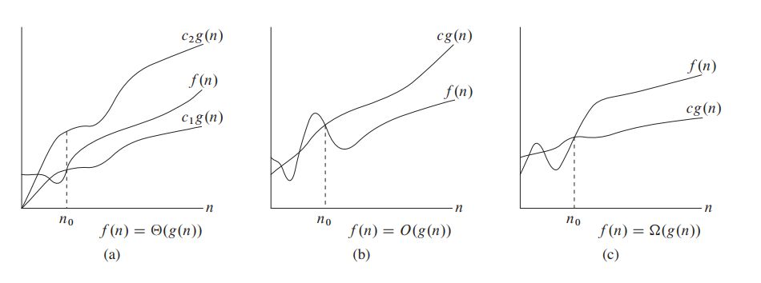

## Introduction

An algorithm is any **well-defined** computational procedure that takes some value, or set of values, as input and produces some value, or set of values, as output. An algorithm is thus a sequence of computational steps that transform the input into the output.

!!!note "What's more important the performance"

    - correctness
    - programmer time
    - maintainability
    - robustness
    - user-friendlinness

!!!note "Why study algorithms and performance"

    - what is feasible and what is impossible
    - understand scalability
        - $O(n)$，$O(n \log n)$
    - mathematical language
    - generalize to other computing resources

!!!Questions
  
    - Given a problem, can we find an algorithm to solve it?
        - **Not always!**
        - Hibert's 10th Problem: Is a indefinate equation with natural number coefficients has a solution?
    - What is a good algorithm
        - **Time!**
        - In polynomial of **input length** time
    - Is a "good" algorithm always exist?
        - Computational complexity theory
        - $P$ versus $NP$
        - **poly time solvable** versus **poly time checkable**

## The problem of sorting

!!!Question
    What is the lower bound of comparisions in the worst case to find both the maximum and minimum

    $$\lceil 3/2 n \rceil - 2$$

!!!Question
    What is the lower bound of comparisions in the worst case to find the second minimum

    $$n + \log n - 2$$

### Insertion sort

#### Best-case

The best case occurs if the array is already sorted

**linear function**

#### Worst-case

If the array is in reverse sorted order, the worst case results
 
**quadratic function**

- The running time depends on input
- Generally, we seek upper bounds on the running time, because everybody likes a guarantee

## Machine-independent time

!!!note "Randon-access machine(RAM) model"

    - No concurrent operations
    - Each instruction takes a constant amount of time
  
!!!note Asymptotic Analysis

    - Ignore machine-dependent constants
    - Look at the growth of $T(n)$ as $n \to \infty$

## Notation

!!!definition

    $$ \Theta(g(n)) = \{f(n) : n \ large \ enough, \exists c_1,c_2, 0 \leq c_1 g(n) \leq f(n) \leq c_2g(n) \} $$

    **Asymptotically tight bound**

!!!definition

    - $O$ -notation: **asymptotically upper bound**
    - $\Omega$ -notation: **asymptotically lower bound**

!!!Question
    
    $$\Theta(n^2) + O(n^2) = ?$$

!!!definition

    $$o(g(n)) = \{f(n) : \forall c > 0, \exists n_0 > 0, s.t. \forall n \geq n_0 , 0 \leq f(n) < cg(n)\}$$

    Intuitively: $\lim_{n \to \infty} \frac{f(n)}{g(n)} = 0$

!!!definition

    $$\omega(g(n)) = \{f(n) : \forall c > 0, \exists n_0 > 0, s.t. \forall n \geq n_0 , 0 \leq cg(n) < g(n)\}$$

    Intuitively: $\lim_{n \to \infty} \frac{f(n)}{g(n)} = \infty$

This notation has the properities

- Transitivity
- Reflexivity
- Symmetry
- Transpose symmetry

## Standard notations and common functions

- Floors and ceilings
- Logarithms
- Stirling's approximation
    - $$ n! = \sqrt{2 \pi n} (\frac{n}{e})^n ( 1 + \Theta(\frac{1}{n}))$$
    - $$\log(n!) = \Theta(n \log n)$$

**Functional iteration**

$$ f^{(i)} = f(f^{(i - 1)}(n)) \ for \ i > 0$$

**The iterated logarithm function**

$$ \log^* n = min\{i \geq 0 : \lg^{(i)} \leq 1\} $$

$$ \log^* (2^{65536}) = 5$$

> there may $10^80$ particles in the universe

!!!Question

    Which is asymptoically larger?

    $\log(\log^n)$ or $\log^*(\log n)$

    the answer is the $$\log^*(\log n)$$, consider a tower of power of 2 with height $k$, the first is $\log k$ and the second is $k$