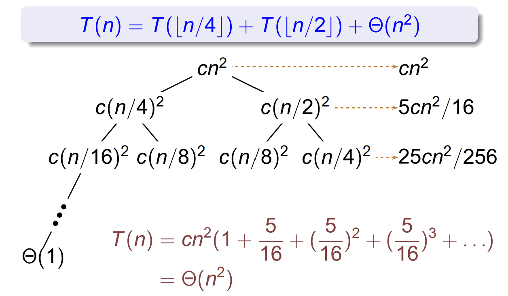

## Recurrences

> Bentley, Haken and Saxe 

!!!note "General method"
    
    - **Guess** the form of the solution
    - **Verify** by mathematical induction

!!!Example 

    $$T(n) = 9 T(\lfloor n / 3 \rfloor) + n$$

    - Prove $T(n) = \leq cn^3$ by induction

!!!Example
    
    **A tighter upper bound?**

    Assume $T(k) \leq ck^2$ for $k < n$

    

    **Wrong!**
    

    但是这个失败的证明可以用来证明 $T(n) = \Omega(n^2)$

!!!Example

    **Strengthen the inductive hypothesis**

    

    Assume $T(k) \leq c_1 k^2 - c_2 k$ for $k < n$

    hence $T(n) = \Theta(n^2)$

    

### The recursion-tree method

### The master method

The master method applies to recurrences of the form

$$ T(n) = aT(n/b) + f(n)$$

where $a\geq 1$, $b \geq 1$, and $f$ is asymptotically positive.

!!!Theorem "The master theorem"

    - if $f(n) = O(n^{\log_b a-\epsilon})$ for some constant $\epsilon > 0$, then $T(n) = \Theta(n^{\log_b a})$
    - if $f(n) = \Theta(n^{\log_b a)$, then $T(n) = \Theta(n^{\log_b a} \lg n$
    - if $f(n) = \Omega(n^{\log_b a+\epsilon})$ for some constant $\epsilon > 0$, and if $af(n/b) \leq cf(n)$ for some constant $c < 1$ and all sufficiently large $n$, then $T(n) = \Theta(f(n))$

### Master method is not omnipotent

- When $f(n)$ is smaller than $n^{\log_b a}$ but not **polynomially** smaller. This is a gap between case 1 and 2
- smaller -> larger
- When the regularity condition in case 3 fails to hold

!!!Example

    $$T(n) = 2T(n/2) + n\lg n$$

    

        **The master method fails**
    

### A more general method

$$ T(n) = \sum_{i = 1}^k a_i T(\lfloor n/b_i \rfloor) + f(n) $$

We first find $p$ s.t. 
$$ \sum_{i = 1}^{p} a_i b_i ^{-p} = 1 $$

The solution is

$$ T(n) = \Theta(n^p) + \Theta(n^p \int_{n'}^{n} \frac{f(x)}{x^{p + 1}} \mathrm{d}x) $$

### Idea of master theorem

!!!note Number of leaves

    $$ a^h = a^{\log_b n} = n^{\log_b a} $$

- Case1: The weight increases geometrically from the root to the leaves. The leaves hold a constant fraction of the total weight.
- Case2: The weight is approximately the same on each of the $\log_b n$ levels
- Case3: The weight decreases geometrically from the root to the leaves.

### Changing variables

!!!Example

    $$ T(n) = 2T(\lfloor \sqrt{n} \rfloor) + \lg n $$