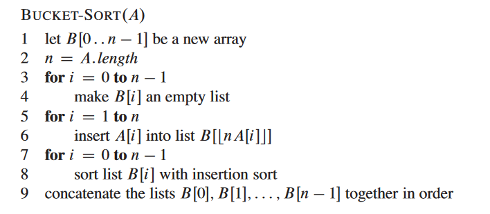
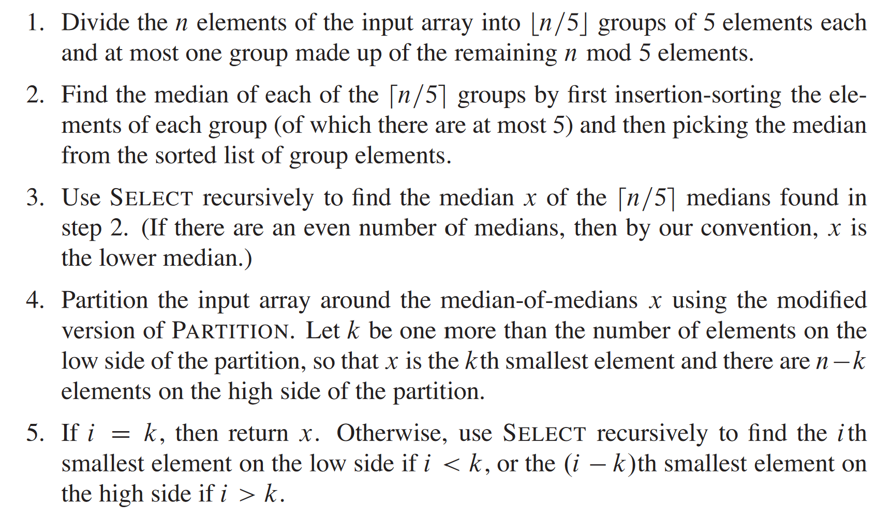
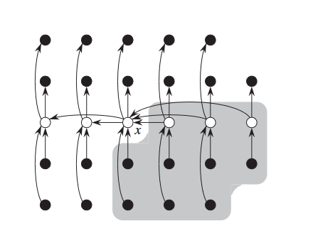

## Sorting in Linear Time

### Decision-tree Model

A decision tree can model the execution of any comparison sort:

- View the algorithm as splitting whenever it compares two elements.
- The tree contains the comparisons along all possible instruction traces.
- The running time of the algorithm = the length of the path taken
- Worst-case running time = height of tree

!!!Theorem
    Any decision tree that can sort $n$ elements must have height $\Omega(n\lg n)$

### Counting sort

!!!Definition

    - Assumption: Each of $n$ input elements is an integer in the range between $0$ and $k$
    - Aim: **Runs in $\Theta(n) time$**
    - Input: $A[1\cdots n]$, where $A[j] \in \{0, 2, \cdots, k\}$
    - Output: $B[1\cdots n]$, sorted
    - Auxiliary storage: $C[0\cdots k]$

This algorithm is too easy, but need to analysis.

!!!Theorem "Stable sorting"
    Counting sort is a stable sort: **it preserves the input order among equal elements**

### Radix sort

Digit-by-Digit sort

- Sort on least-significant digit first with auxiliary stable sort
- By counting sort

#### Correctness of radix sort
    
- Assume that the numbers are sorted by their low-order $t-1$ digits
- Sort on digit $t$
    - Two numbers that differ in digit $t$ are correctly sorted
    - Two numbers equal in digit $t$ are put in the same order as the input

#### Analysis of radix sort

- Auxiliary stable sort.
- Sort $n$ computer words of $b$ bits each.
- Each word can be viewed as having $b/r$ base-$2^r$ digits.

The question is that **how many passes $r$ should we make?**

- Counting sort takes $\Theta(n + k)$ time to sort $n$ numbers in the range from $0$ to $k - 1$

Since there are $b/r$ passes, we have

$$T(n,b) = \Theta(\frac{b}{r} (n + 2^r))$$

Choose $r$ to minimize $T(n,b)$，$r = \lg n$ implies 

$$ T(n, b) = \Theta(bn / \lg n) $$

**Amazing Result!**

### Bucket Sort

!!!Note "Idea"
    Assume the input array $A$ is generated by a random process that distributes elements uniformly over the inverval $[0,1)$

#### Analysis of bucket sort

$$T(n) = \Theta(n) + \sum_{i = 0}^{n - 1} O(n_i^2)$$

We define the indicator random variables $X_{ij} = 1_{A[j]\text{falls in bucket } i}$. Thus $n_i = \sum_{j=1}^n X_{ij}$

Use some tedious math

$$ E[n_i^2] = 2 - \frac{1}{n} $$

And the result is

$$ E[T(n)] = \Theta(n) $$

The bucket sort will run in linear time.

## Medians and Order Statistics

### Selection in expected linear time

Define the indicator random variable $X_k$，if the subarray has excatly $k$ elements

$$ T(n) \leq \sum_{k = 1}^n X_k (T) $$

Then take the expectation and calculate ..., the math in CLRS is too annoying.

### Selection in worse-case linear time

The Key idea in the proof can be described in the following picture

