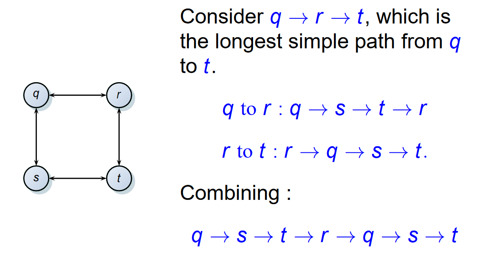

## Dynamic Programming

### 最大字段和

#### Divide and Conquer

$$O(n \log n)$$

#### Dynamic Programming

- State: The max subsequence sum end at index $i$, which is called $f(i)$
- Transition:
    - $f(i) = \max (A[i], f(i - 1) + A[i])$
- Solution:
    - $\max_{i \in \{ 1, \cdots N\}} f(i)$

!!!Question
    

    How to get the construction of answer?
    

## Overview

- **Dynamic Programming** vs **Divide and Conquer**
    - Sililarities
        - partition
        - combining
    - Differences
        - overlapping subproblems vs no overlapping subproblems
        - DP is typical applied to optimization problems

- **Steps of DP**
    - Characterize the structure of an optimal solution
    - Recursively define the value of an optimal solution
        - Top Down Approach
    - Compute the value of an optimal solution in a bottom-up fashion
    - Construct an optimal solution from computed information

## Rod cutting

!!!Question
    
    Given a rod of length $n$ inches and a table of prices $p_i$ for $i = 1, 2, \cdots ,n$, determine the maximum revenue $r_n$ obtainable by cutting up the rod and selling the pieces.

!!! Solutions

    - Top-down with memoization
    - Bottom-up solution

## Matrix-chain multiplication

## Elements of DP

How to discover optimal substructure

- Make a choice to split the problem into one or more subproblems
- Just assume you are given the choice that leads to an optimal solution
- Given this choice, try to best characterize the resulting space of subproblems
- Show the subproblems chosen are optimal by using a "cut-and-paste" technique

!!!Example "Independence of subproblems"

    **Unweighted longest simple path**

    
    
    - The subproblems in finding the longest simple path are not independent
    - **independent**: The solution to one subproblem does not affect the solution to another subproblem of the same problem.