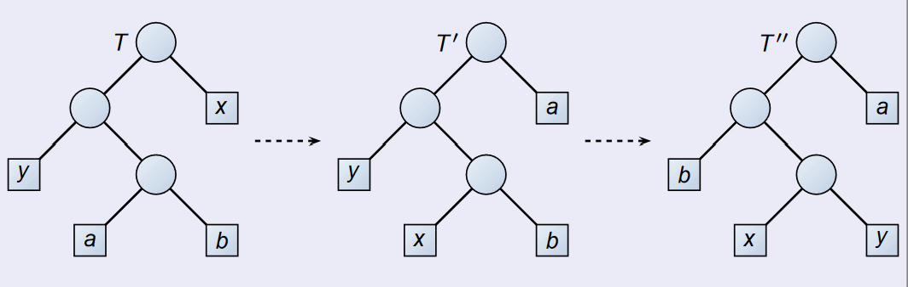

## Knapsack problem

!!! Question "knapsack problem"

    - 0-1 knapsack problem
    - Fractional knapsack problem

    Given $n$ items, the $i$th item is worth $v_i$ dollars and weights $w_i$ pounds, where $v_i$ and $w_i$ are integers. Give a knapsack with capacity $W$ pounds, how to get a load with most valuable items?

- Greedy selection only works on Fractional knapsack problem

## Huffman codes

!!! Definition

    A **variable-length code** can do considerably better than a fixed-length code

    Prefix(-free) codes: The codes in which no codeword is also a prefix of some other codeword

!!! Huffman codes

    give frequent characters short codewords and infrequent characters long codewords

!!! Cost of a tree

    $$B(T) = \sum_{c \in C} c.freq \cdot d_T(c)$$

    $d_T(c)$ is the depth of $c$ in the tree $T$

### Constructing a Huffman code

```
for i = 1 to n-1
    allocate a new node z
    z.left = x = EXTRACT-MIN(Q)
    z.right = y = EXTRACT-MIN(Q)
    z.freq = x.freq + y.freq
    INSERT(Q,z)
return EXTRACT-MIN(Q)
```

### Correctness of Huffman's Algorithm

!!! Idea

    Prove the greedy selcetion is "safe"

!!! Lemma 

    Let $C$ be an alphabet in which each character $c \in C$ has frequency $c.freq$. Let $x$ and $y$ be two characters in $C$ having the lowest frequencies. Then there exists an optimal prefix code for $C$ in which the codewords for $x$ and $y$ **have the same length and differ only in the last bit**

    "The greedy selection properity"

    !!! Proof

        We prove the lemma by construction. Convert a optimal solution to another optimal solution with the given prop in the lemma.

        

!!! Lemma
    
    Let $C' = \{C - \{x,y\}\} \cup \{z\}$, where $z.freq = x.freq + y.freq$. Let $T'$ be any tree representing an optimal prefix code for alphabet $C'$. Then the tree $T$, obtained from $T'$ by replacing the leaf node for $z$ with an internal node having $x$ and $y$ as children, represents an optimal prefix code for the alphabet $C$.

    !!! Proof

        $B(T) = B(T') + x.freq + y.freq$

        "**Optimal substructure**"

!!! Theorem 

    Procedure *HUFFMAN* produces an optimal prefix code.

    !!! Proof

        Corollary of the two lemmas

## Matroids

!!! Definition

    A **matroid** is an ordered pair $M = (S, \mathcal{I})$ satisfying the following conditions.

    - S is a finite nonempty set
    - $\mathcal{I}$ is hereditary: $\mathcal{I}$ is nonempty family of subsets of $S$, called the **independent** subset of $S$, such that if $B \in \mathcal{I}$ and $A \subset B$ the $A \in \mathcal{I}$. Obvious $\emptyset \in \mathcal{I}$
    - if $A,B \in \mathcal{I}$ , and $|A| < |B|$, then there is some elements $x \in B \setdiff A$ such that $A \cup \{x\} \in \mathcal{I}$. **exchange property**

!!! Example

    Graphic matroid.


!!! Definition

    Give a matroid $M = (S ,\mathcal{I})$, we call an element $x \notin A$ an **extension** of $A$ \in \mathcal{I}$ if $x$ can be added to $A$ while preserving independence; that is $x$ is an extension of $A$ if $A \cup \{x\} \in \mathcal{I}$

    - $A$ is maximal if it has no extensions.

!!! Theorem

    All maximal independent subsets in a matroid has the same size

    !!! Example

        Spanning tree is the maximal set in the Graphic matroid.

!!! Definition "Weighted Matroid"

    a strictly positive weight $w(x)$ to each element $x \in S$.

    $w(A) = \sum_{x \in A} w(x)$

- Why weighted matroid
    - Many problems for which a greedy approach provides optimal solutions can be formulated in terms of finding a **maximum-weight independent subset** in a weighted matroid.
    - Example: Minimum-spanning-tree problem

### Greedy algorithm on a weight matroid

```
A = \emptyset
sort M.S into monotonically decreasing order by weight w
for each x in M.S, taken in monotonically, decreasing order by weight w(x)
    if A \cup {x} \in M.I
        A = A \cup {x}
return A
```

This is an $O(n \lg n + n(f(n))$ algorithm, f(n) is the complexity of judging independence.

### Correctness of the Algorithm

!!! Lemma

    **Matroids exhibit the greedy-choice property**

    **Prove by construction** !!!

!!! Lemma

    Let $M = (S, \mathcal{I})$ be any matroid. If $x$ is an element of $S$ that is an extension of some independent subset $A$ of $S$, then $x$ is also an extension of $\emptyset$.

    Let $M = (S, \mathcal{I})$ be any matroid. If $x$ is an element of $S$ such that $x$ is not an extension of $\emptyset$, then $x$ is not an extension of any independent subset $A$ of $S$.

!!! Lemma

    Matroids exhibit the optimal-substructure property

!!! Theorem "Correctness of the greedy algorithm on matroids"

    If $M = (S, \mathcal{I})$ is a weighted matroid with weight function $w$ , then $GREEDY(M, w )$ returns an optimal subset.

## A task-scheduling problem

**scheduling unit-time tasks with deadlines and penalties for a single processor**