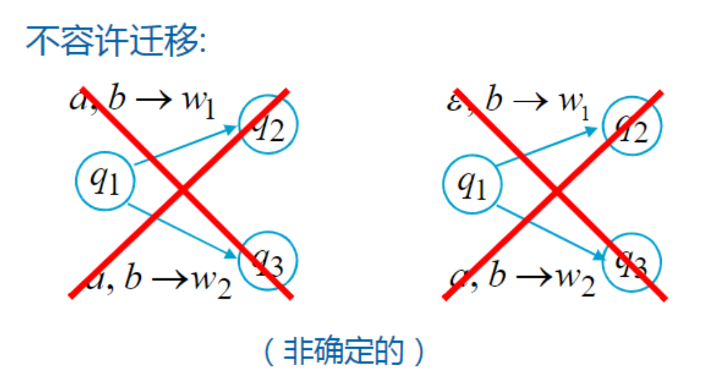
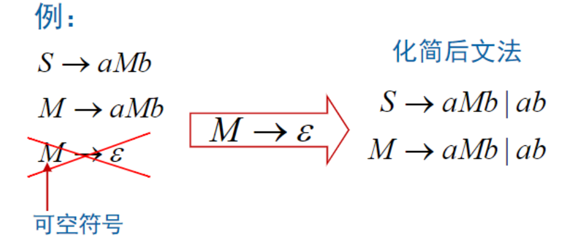

## DPDA

### 确定下推自动机

!!! Definition

    PDA $P = (Q, \Sigma,\Gamma, \delta, q_0, Z_0, F)$ 称为确定的下推自动机，如果满足
    
    1. 对于 $a \in \Sigma$ 或 $a = \epsilon$, $X \in \Gamma - \{\epsilon\}$, $\delta(q, a, X)$ 最多包含一个元素
    2. 对于 $a \in \Sigma$, $a \neq \epsilon$，若 $\delta(q, a, X) \neq \emptyset$, 则 $\delta(q, \epsilon, X) = \emptyset$
   

### DPDA 的语言

!!! Example

    $L = \lbrace ww^R \mid w \in \lbrace 0, 1\rbrace^* \rbrace$

    有 PDA 接受该语言，但是没有 DPDA 接受该语言

NPDA 的表达能力比 DPDA 的表达能力更强。

!!! Theorem

    若 $L$ 是正则语言，则存在一个 DPDA $P$，使得 $L(P) = L$

!!! Theorem 

    DPDA 的表达能力强于有限自动机

    例如 $L = \{wcw^R \mid w \in \{0,1\}^*\}$，不是正则语言，但是是一个 DPDA的语言。

### 终态型 DPDA 与空栈型 DPDA

!!! note

    前缀性质：一个语言 $L$ 具有前缀性质，当且仅当不存在 $x,y \in L$, $x \neq y$, 且 $x$ 为 $y$ 的前缀。

!!! Theorem

    语言 $L$ 是空栈型 DPDA　$P$ 的语言，当且仅当

    - $L$ 具有前缀性质
    - $L$ 是某终态型 DPDA $P'$ 的语言

    $$\{ \text{空栈型DPDA的语言}\} \subsetneq \{ \text{终态型DPDA的语言}\}$$

    真包含的例子 $L = L(a^*)$ 没有前缀性质。

### DPDA 与二义文法

!!! Theorem

    若语言 $L$ 是空栈型 DPDA P 的语言，则存在无二义上下文无关文法 $G$ 使得 $L = L(G)$，进一步，有

    $$\{\text{DPDA语言}\} \subsetneq \{\text{CFG非固有二义语言}\}$$

    真包含的例子 $L = \{ww^R \mid w \in \{0,1\}^* \}$

## CFG 化简与规范

### 消去无用符号

!!! definition

    有用符号（useful symbol）

    - 对于 CFG $G = (V,T,S,P)$ 称符号 $x \in V \cup T$ 是有用的，当且仅当 
        - $$S \xRightarrow{*} \alpha X \beta \xRightarrow{*} w$$
        - 其中 $w \in T^*, \alpha, \beta \in w$

    所谓无用符号就是 非有用符号

    - 无用产生式：含有无用符号的产生式
        - 产生式推导不能终止
        - 开始变量不可达

!!!Definition

    产生符号：$X$ 称为产生符，如果存在 $w \in T^*$ 满足 $X \xRightarrow{*} w$

    可达符号：$X$ 称为可达符，如果存在 $\alpha,\beta \in (V \cup T)^*$，满足 $S \xRightarrow{*} \alpha X \beta$

    约定：终结符是产生符，$S$ 是可达符

!!! Algorithm

    对 $G = (V,T,S,P)$ 产生符集合由如下步骤计算：
    
    - 基础：任何终结符 $a \in T$ 都是产生符
    - 归纳：若有产生式 $A \to \alpha$，且 $\alpha$ 中的每个符号都是产生符，则 $A$ 也是产生符

    对 $G$，可达符集合可由下列步骤计算
    
    - 基础：$S$ 是可达符
    - 归纳：若 $A$ 是可达符，且 $A \to \alpha$，$\alpha \in (V \cup T)^*$ 则 $\alpha$ 中的符号都是可达符
  
!!! Note "消去无用符号"

    - 计算产生符集合
    - 消去非产生符号
    - 计算可达符号集合
    - 消去不可达符号

### 消去 $\epsilon$ 产生式

目的：方便文法的设计，利于文法的规范化。

!!! definition

    可空符号：设 CFG $G = (V,T,S,P)$，称符号 $A \in V$ 是可空的，如果 $A \rightarrow \epsilon$

!!! Algorithm

    计算步骤：对于 CFG $G = (V,T,S,P)$，可空符号集合通过下列归纳步骤计算

    - 基础：对所有产生式 $A \to \epsilon$，$A$ 是一个可空符号
    - 归纳：如果有产生式 $B \to C_1\cdots C_k$，其中每一个 $C_i \in V$ 是可空符号，则 $B$ 也是可空符号

!!!note "消去 $\epsilon$ 产生式"

    - 计算可空符号集合
    - 对每一个产生式 $A \to A_1 \codts A_k$，在新的 CFG 中，每一个可空符号都可能出现或不出现

### 消去单一产生式

!!! Definition "单一产生式"

    形如 $A \to B$ 的产生式，其中 $A$ $B$ 为非终结符

消去单一产生式可以减少文法的数量，简化文法推导。

!!! Definition "单一偶对"

    设 CFG $G = (V,T,P,S)$，$A,B \in V$，$(A, B)$ 称为单一偶对，如果 $A \xRightarrow{*} B$ 且该推导过程仅使用单一产生式。

    消去单一产生式时，需要计算所有单一偶对的集合。

!!! Algorithm

    先计算单一偶对
  
    - 基础：对于任何 $A \in V$，$(A,A)$ 是一个单一偶对
    - 归纳：如果 $(A,B)$ 是一个单一偶对，且 $B \to C$ 是产生式（$C \in V$），$(A, C)$ 是一个单一偶对

    消去单一产生式的算法

    - 计算 $G$ 的单一产生式集合
    - 对每个单一偶对 $(A,B)$ 在 $G_1$ 中加入 $A \to \alpha$，其中 $B \to \alpha$ 为一非单一产生式
    - $G_1$ 中包含 $G$ 中所有非单一产生式

### CFG 的化简与 Chomsky 范式

!!! Note "CFG 的简化"

    - 消去 $\epsilon$ 产生式
    - 消去单一产生式
    - 消去无用产生式

!!! Theorem

    设 CFG $G$ 的语言包含非 $\epsilon$ 字符串，通过上述步骤从 CFG $G$ 构造 CFG $G_1$，则有

    $$L(G_1) = L(G) -\{\epsilon\}$$

!!! Definition "Chomsky 范式"

    - $G$ 中不含无用符号
    - 产生式 $P$ 中只具有如下两种简单形式之一
        - $$A \to BC \quad A \to a$$

    它的语法分析树是一个二叉树

!!! Algorithm "转化 Chomsky 范式"

    - 消去 $\epsilon$ 产生式
    - 消去单一产生式
    - 消去无用产生式

    得到一个 CFG $G_2$，将 $G_2$ 作如下变换

    - 如果某一终结符 a 出现于某些右部长度大于 1 的产生式中，则引入一个新的非终结符，如 $A$，将这些产生式中的 $a$ 替换为 $A$，并增加产生式
        - $A \to a$
        - 则右边长度大于 1 的产生式中只有非终结符
    - 右部长度 $> 2$ 的产生式 $A \to B_1 \cdots B_k$，采用级联的方式转变为只含有两个非终结符；引入 $k - 2$ 个新的非终结符
        - $A \to B_1 C_1 , C_1 \to B_2 C_2 \cdots$

