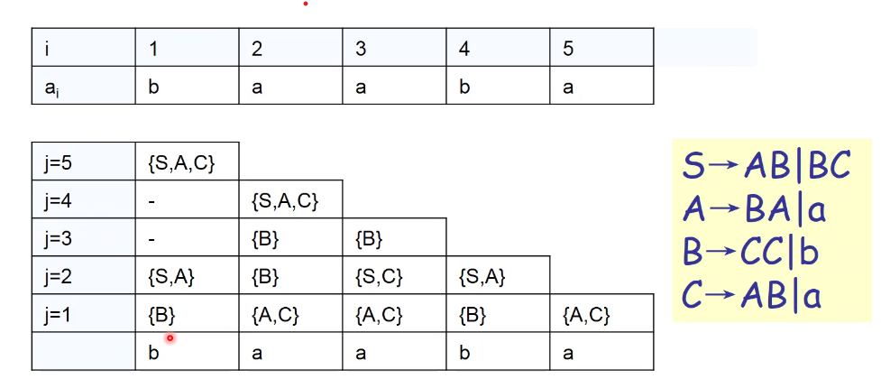

## CFL 的判定性质

- 空语言问题：给定一个 CFG，如何判定 $L(G) = \emptyset$
    - 检测开始变量是否是无用符号
- 无限语言问题：给定一个 CFG $G$，如何判定其语言是无限的
    - 消去 $\epsilon$ 产生式和单一产生式
    - 消去无用符号
    - 构造变量依赖图
    - 若图中有环，则其语言是无限的
- 语言元素问题：给定一个 CFG $G$，如何判定字符串 $w \in L(G)$
    - 穷尽分析树搜索法
    - CYK 算法

!!!note CYK 算法基本思想

    设 $G = (V, T,S,P)$ 为满足 CNF 的 CFG，$w = a_1a_2 \cdots a_n \in T^*$；

    迭代计算满足下列条件的 $X_{ij}$ ($1 \leq i \leq j \leq n$)

    1. $X_{ij} \subseteq V$
    2. $A \in X_{ij} \iff A \Rightarrow a_i \cdots a_j$

    因此 $w\in L(G) \iff S \in X_{1n}$

!!!note CYK 算法的迭代计算

    1. $j = i$，若 $"A \to a_i" \in P$，则 $A \in X_{ij}$
    2. $i < j$，$A \in X_{ij} \iff \exist k, i\leq k \leq j$，可以找到 $B \in X_{ik}$ 和 $C\in X_{(k+1) j}$，使得 $(A \to BC) \in P$

    算法的时间复杂度为 $O(n^3)$

!!! note CYK 算法的例子

    

!!!note CFG 的一些不可判定问题

    - 上下文无关文法是否是无歧义的
    - 上下文无关语言是否是固有歧义的
    - 两个上下文无关语言相交是否为空
    - 两个上下文无关语言是否相等
    - 上下文无关语言是否等于 $\Sigma^*$

## Turing 机介绍

- 基本 Turing 机
  - 组成：Finite control，tape，tape head，blank（空白带符），cell，tape symbol
  - 带的两端是无限的
  - 每一步，读头需完成如下动作
      - 读一个符号
      - 写一个符号
      - 左移或右移
- 输入字符串
    - 输入串不能为空
    - 读头开始时位于输入串的最左端
- 状态转移
    - $a \to b, L$ 读 $a$，写 $b$，左移，也有的记为 $a / b \leftarrow$
        - $\delta(q_1,a) = (q_2, b, L)$
    - $a \to b, R$ 读 $a$，写 $b$，右移，也有的记为 $a / b \rightarrow$
        - $\delta(q_1,a) = (q_2, b, R)$
- 识别字符串
    - 接受输入 $\iff$ 当输入完字符串，TM 停在某终态
    - 拒绝输入 $\iff$ TM 停在一个非终态，或者 TM 进入一个无限循环

## Turing 机定义

!!! note Turing机的形式化定义

    一个 TM 是一个 七元组 $M = (Q, \Sigma, \Gamma, \delta, q_0, B, F)$

    - 有限状态集合
    - 有限输入符号集
    - 有限带符号集
    - 转移函数
        - $\delta: Q\times \Gamma \to Q \times \Gamma \times \lbrace L, R\rbrace$
    - 开始状态
    - 空白符
    - 终态集合

## Turing 机即时描述

!!!note 

    图灵机 $M$，当前格局 $X_1X_2\cdots X_{i-1}qX_i\cdots X_n$ 称为即时描述，其中

    1. $q \in Q$ 为当前 $M$ 的状态
    2. 当前读头正在扫描 $X_i$

!!! note 推导关系

    给定图灵机 $M = (Q, \Sigma, \Gamma, \delta, q_0, B, F)$，定义 $ID$ 之间的推导关系如下

    - 设 $\delta(q, X_i) = (p, Y, L)$ 有
        - $X_1 \cdots X_{i-1} q X_i X_{i+1} \cdots X_n \vdash X_1 \cdots X_{i-2} p X_{i-1}Y X_{i+1} \cdots X_n$
        - 两个例外情况
            - $i = 1$ 时
            - $i = n$ 且 $Y = B$ 时
    - 右移的情形同理

## Turing 机语言

!!!note 递归可枚举语言 (Recursive enumerable languages)

    图灵机接受的语言称为递归可枚举语言。

    给定图灵机 $M = (Q, \Sigma, \Gamma, \delta, q_0, B, F)$，定义 $M$ 的语言

    $$L(M) = \lbrace w\mid w\in \Sigma^*, q_0 w \vdash^*_M \alpha p \beta, p\in F, \alpha \in \Gamma^*, \beta \in \Gamma^* \rbrace $$

- 停机：若 TM 没有可能的后续转移，则停机
- 定理：任给一个图灵机，容易构造另一个图灵机 $M'$，使得 $L(M) = L(M')$，并满足：如果 $w \in L(M)$，则对于 $w $，$M'$ 接受 $w$ 并一定停机

!!! note 递归语言

    称语言 $L$ 是递归的，当且仅当存在图灵机 $M$，$L = L(M)$，且满足

    1. 若 $w \in L(M)$，则对于 $w$，$M$ 接受 $w$，自然会停机
    2. 若 $w \notin L(M)$，则对于 $w$，$M$ 最终也会停机