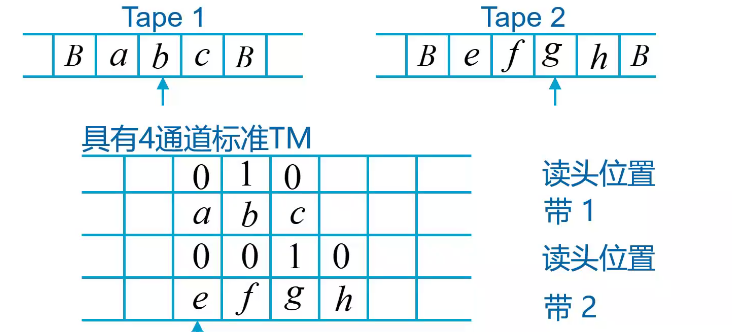
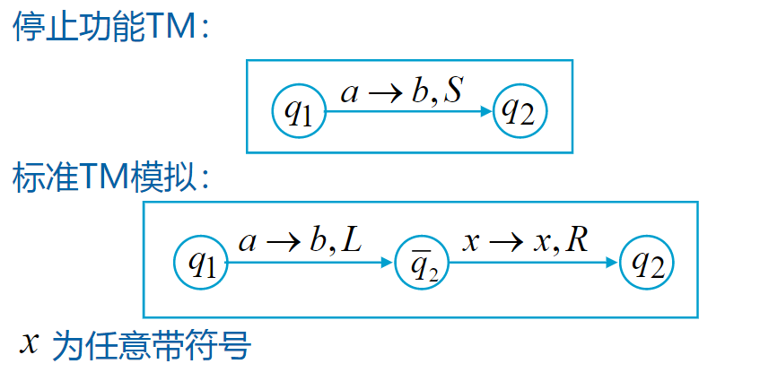

## Turing 机的计算

!!!note 整数表示

    选用单位制表示，易于图灵机的操作

!!!note 函数计算

    函数 $f$ 是可计算的，如果存在图灵机 $M$，对任意 $w \in D$，满足

    $$f: a_o w \vdash^* q_f f(w)$$

!!!example
  
    - $f(x, y) = x + y$
    - $f(x) = 2x$
    - $f(x, y) = \begin{cases} 1 & x > y \\ 0 & x \leq y \end{cases}$

## Turing 机编程

!!!note 增加参数

      $$Q = S \times T = \{[q,a] \mid q\in S, a\in T\}$$

      其中 $q \in S$ 是控制状态，$a \in T$ 为参数

!!! note 多道图灵机

    将符号的形式改为多元组，即可实现多道 Turing 机

!!! example 子例程的设计

    - 复制数 $0^n$ 的子程序
    - 计算乘法 $n \times m$ 的 Turing 机
        - 将复制的子程序作为一个组件
## Turing 理论

!!!note Turing 的观点

    能机械计算的一定能用 Turing 机实现

到目前为止，没有比 Turing 机更强的计算模型

!!! note 图灵机的等价

    - 图灵机 $M_1$ 和 $M_2$ 称为等价，如果 $L(M_1) = L(M_2)$
    - 两类图灵机的功能相同是指：两类图灵机接受相同的语言集合
    - 证明 TM 等价的方法：模拟

## TM 带的扩展

!!! Warning 
    
    多通道 Turing 机和多带 Turing 机是不同的

!!! note 多带图灵机也是标准 Turing 机

    $k$ 个带的图灵机可以用 $2k$ 道的图灵机模拟

    

    也就是说：多带图灵机与标准图灵机功能相同，但是速度并不一定一样

!!! question

    如何设计一个双带Turing 机 接受语言

    $$L = \{0^n1^n2^n \mid n \geq 1\}$$

!!! note 多维图灵机

    可以用标准 Turing 机模拟，整两个道，记录坐标

## 状态转移的扩展

!!! note 停止功能的图灵机

    读头可以停在原来的位置

    显然停止功能的图灵机可以模拟标准图灵机，我们说明标准图灵机也可以模拟停止功能图灵机

    

!!! note 非确定图灵机   

    非确定自动机：TM 下一步移动有多种选择

    转移函数定义为

    $$\delta: Q\times \Gamma \to \mathcal{P}^{Q \times \Gamma \times D}$$

    定理：非确定 TM 与标准 TM 具有相同的功能 

## 受限图灵机

!!!note 半无限带机

    显然标准图灵机可以模拟半无限带机，利用一个两通道半无限带机也可以模拟标准图灵机

## Turing 机与其它自动机

!!!note 多栈机

    