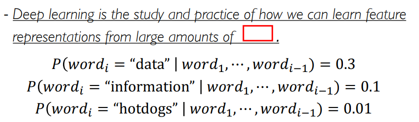
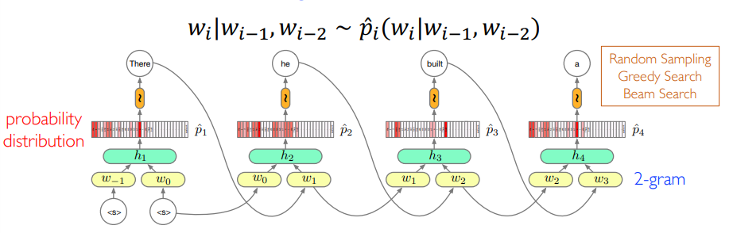
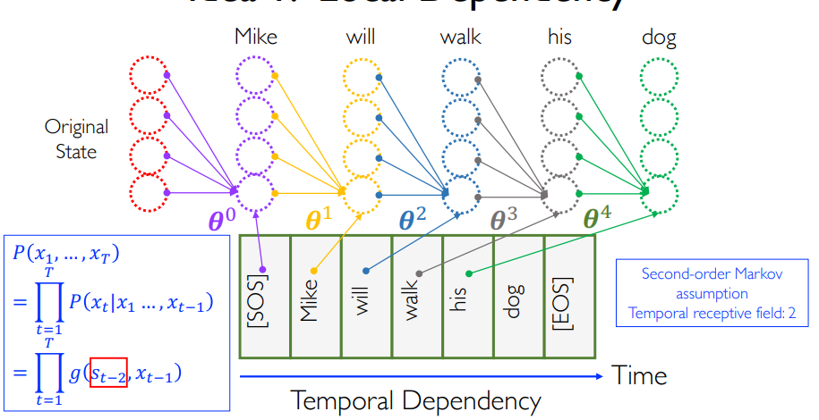
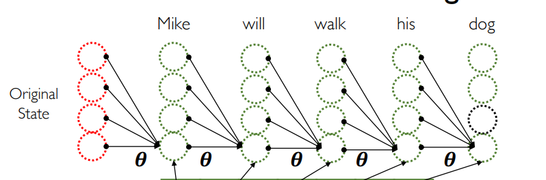
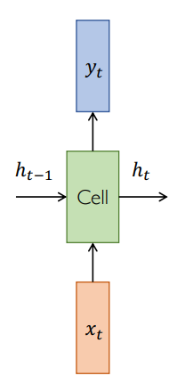
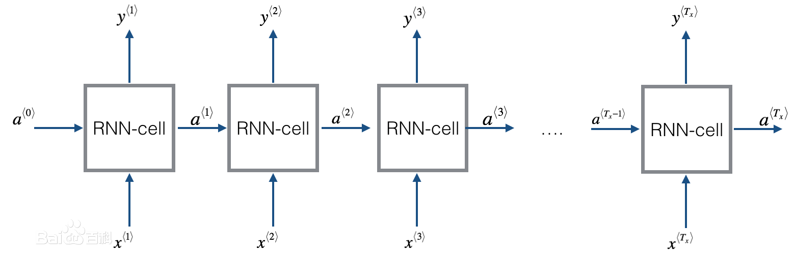
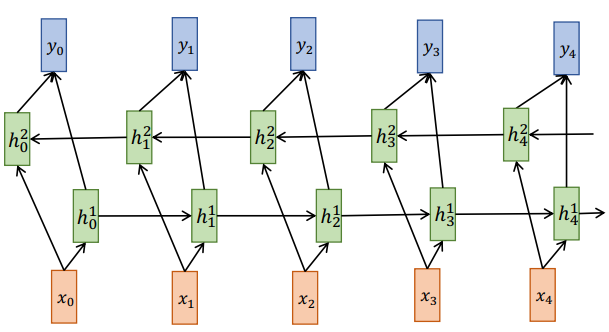
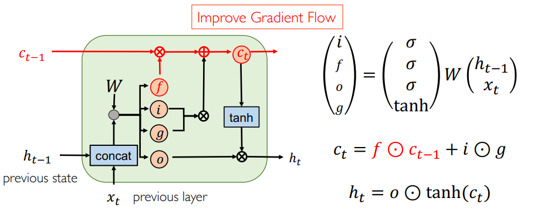

## Recurrent Neural Network

### Sequence Modeling

- 我们需要 sequences
- Language Modeling
- 

### Language Modeling

我们需要建模一个概率分布，给定之前 $i$ 个词，建模第$i$个词的概率分布。

### What If MLP

把所有词向量 concat 起来，然后扔进 MLP 中，输出的大小为 Vocabulary Size，然后在里面 Sample。

**2-gram LM Model**

这显然会有很多缺点
- Parameter explosion
- There is a limit on the longest dependencies that can be captured.

### Idea 1: Local Dependency

$$ P(x_1,\cdots,x_T)  = \prod_{t = 1}^{T} P (x_t \mid x_1,\cdots,x_{t-1}) = \prod_{t=1}^{T} g(s_{t-2},x_{t-1})$$

我们认为 $t - 2$ 之前的信息可以编码进一个隐变量 $s$ 中，于是用 $\prod_{t=1}^{T} g(s_{t-2},x_{t-1})$ 做近似。

- [**Local Dependency Assumption**]: The sequential informational of all previous timestamps can be encoded into one **hidden representation**.

### Idea 2: Parameter Sharing

- [**Temporal Stationarity Assumption**]: If a feature is useful at time $t_1$，then it should also be useful for all time stamps $t_2$

这有时会导致出现 over smoothing 的事情，无法对很有特点的事情进行描述。

### Recurrent Neural Network (RNN)

一个 RNN cell 就是一个 MLP 加上一个 $h_{t-1}$ ， 多输出一个 $h_t$，也就是前面所说的编码起来的信息。

把这些东西拼起来。

### Recurrent Layer

数学上的表示就是

$$ y_t = V h_t $$

$$ h_t = f_W (h_{t-1}, x_t) $$

### Bidirectional RNN

发扬上面的精神，从后面也拉一波过来

### Deep RNN

加层，多整几个隐藏层，竖着加隐藏层，横着在时间轴上多整几个 RNN Cell。

### RNN for LM

**n-gram LM Model**

### Standard Architectures

- many to one: Sentiment Classification
- one to many: Image Captioning
- many to many (heterogeneous): Machine Translation
- many to mang (homogeneous): Language Modeling

### One to Many

常用于图像描述等问题。

Challenges:

- Long-term dependency: which word corresponds to which region
- Heterogeneous input and output: from image to text generation

### Sequence to Sequence

**Many-to-One + One-to-Many**

- Encoder: many to one
- Decoder: one to many

**information bottleneck**

### Beam Search

## Back-Propagation Through Time

- RNNs are particularly unstable due to te repeated mulitplication by the same weight matrix.

## Exploding and Vanishing Gradient

### Exploding Gradient: Gradient Clipping

$$g := \frac{\partial \epsilon}{\partial \theta}$$

如果 $\Vert g \Vert$ 大于某个阈值，就给它 normalize 成一个给定的阈值。

### Vanishing Gradient: Identity Initialization?

**Not work well**

### Long Short-Term Memory (LSTM)

> Hochreiter and J. Schmidhuber. Long short-term memory,1995 

## PracticalTraining Strategies

## Spacetime Long Short-Term Memory