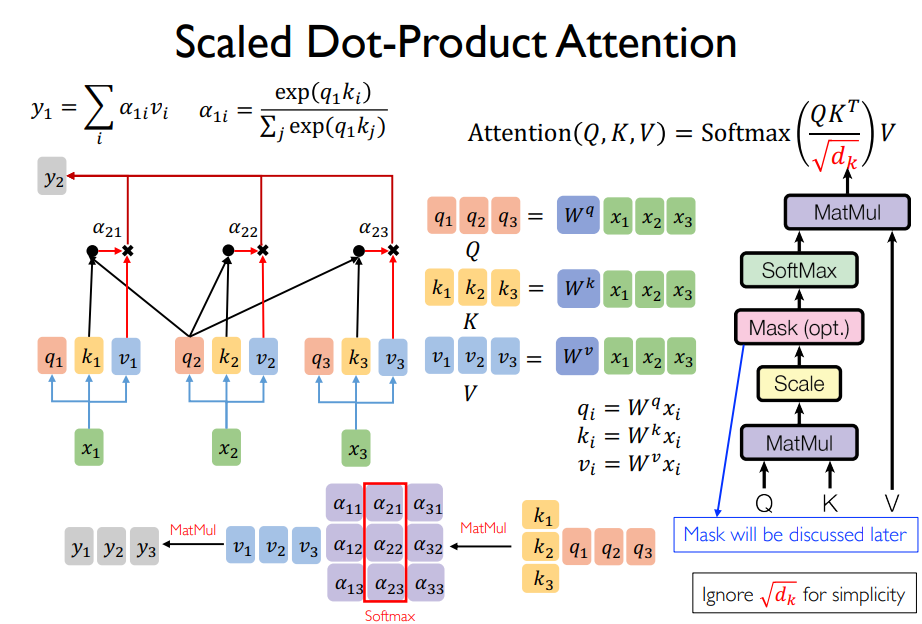

## Attention and Memory

### Human Intelligence vs.Artificial Intelligence

目前我们比较缺少的东西

- Attention
- Memory

#### Attention

我们现在主要要解决的是 **Selective Attention**，也就是选择式注意力。

- Temporal Attention
- Spatial Attention

#### Memory

**Sensory Memory**：taste, touch, sight, hearing and smell

CNN 可以理解为 Sensory memory，或者说 CV 就是一种感知的技术。

**Short-Term Memory (Working Memory)**:  recall for a period of 
several seconds to a minute without rehearsal

LSTM 提供了一些 Short-Term Memory，它使得 RNN 有一定这种能力

**Long-Term Memory**: tore much larger quantities of 
information for potentially unlimited duration. Long-term memory enables memory storage, retrieval and recall.

我们之前提到的技术都不具有这些能力

## RNN with Temporal Attention

### Autoregression (AR)

- 会造成误差累积

### Sequence to Sequence

- Machine Translation

还是需要 Markov Assumption，同时需要将 $x_1,x_2,\cdots,x_T$ encode 到一个 hidden state 中。

$$ p(y_1,\cdots,y_{T'} \mid x_1, \cdots ,x_T)  = \prod_{t =1}^{T'} g(c, s_{t - 2}, y_{t-1}$$

&emsp; 一个重要的问题就是 $c$ 是一个 information bottleneck，模型好不好完全取决于这个 $c$ 的质量。
同时过长的传播路径会导致梯度消失的问题，即使用 LSTM 也不能完全解决。最后输入的词条的顺序有可能在不同的 source 中不同， 输出也是一样。

### Temporal Attention

**Attention enables the model to see globally! **

&emsp; 比如在语言任务中，我们要想知道 how important is each word， 我们给出一个权重来度量这个事情，但是由于找不到合适方式，我们就要 **Learn it! **，这里设 $e_{ij} = a(s_{i -1}, x_j)$，度量第 $i$ 个状态下 $x_j$ 有多重要。

&emsp; 做一个 Softmax，得到

$$ \alpha_{ij} = \frac{\exp(e_{ij})}{ \sum_{k = 1}^T \exp(e_{ik})} $$

做一个加权和作为 context vector

$$ c_i = \sum_{j = 1}^T \alpha_{ij} x_j $$

把这些东西都投入下一个 state 的计算。

$$ s_i = f(s_{i -1}, y_{i - 1}, c_i) $$

### Hierarchical Attention

- Attention could be stacked as NNs

### Neural Turing Machine

- Nerual Network with Turing Machine Architecture

## Transformers: Self-Attention is All you need

### Attention Framework

Represent elements in Attention by:

- Key $k$
- Query $q$
- Value $v$

### Self-Attention

> -  “In RNN, we need attention modules!”
> -  “Sure.With attention, we even don’t need RNN.”

- Self-attention: $K, Q, V$ are from the same place

### Challenge: Self-Attention

- Temporal attention 可以用来做 self-attention
- But it is **wasteful**

### Scaled Dot-Product Attention

Given query $q$ and key $k$ (to be matched)

- Scaled Dot Product
    - $$a(q,k) = q^T k / \sqrt{d_k}$$
    - Scale by size of the vector

$$ Attention(Q,K,V) = Softmax(\frac{QK^T}{\sqrt{d_K}}) V $$

### Multi-Head Attention

类似于之前提到过的 Group Convolution

- like channels in CNNs

### Position-wise FFN

