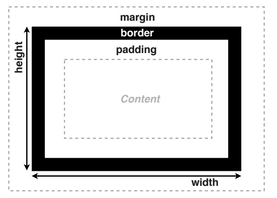

## 基础选择器

### 选择器组

```css
body, h1, h2, ul, ol, li {
    margin: 0;
    padding: 0;
}

[type="checkbox"], [type="radio"] {
    box-sizing: border-box;
    padding: 0;
}
```

## 设置字体

```css
h1 {
    font-family: Optima, Georgia, serif;
}
```

`serif`：通用字体族

!!!note "通用字体族"

    - serif 衬线体
    - Sans-Serif 无衬线体
    - Cursive 手写体
    - Fantasy
    - Monospace 等宽字体

!!!note 建议

    - 字体列表最后写上通用字体族
    - 英文字体放在中文字体前面

!!!note Web Fonts

    ```css
    @font-face {
        font-family: 'Megrim';
        src: url('/mergrim.woff2') format('woff2');
    }

    h1 {
        font-family:  'Megrim';
    }
    ```

!!!note font-size
    - 关键字
        - small、medium、large
    - 长度
        - px、em
    - 百分数
        - 相对于父元素的大小

!!!note font-style

    - 斜体
        - `font-style: italic`

!!!note line-height

    用于调整行高

    ```css
    line-height: 45px;
    line-height: 1.6;
    ```

!!!note font

    `font: style weight size/height family`

## 设置文字样式

- text-align
    - 设置文字的对齐方式
    - left center right justify
- spacing
    - letter-spacing
    - word-spacing
- text-indent
    - 调整缩进
- text-decoration
    - 用于文字修饰
    - none underline line-through overline
- white-space
    - normal nowrap pre pre-wrap pre-line
- text-shadow
    - `text-shadow color offset-x offset-y blur-radius`

## 盒模型基础

- width height
- padding
- border
    - 边框样式、粗细和颜色
    - border-width border-style border-color
    - 设置方向：border-top-color border-left
- margin
    - margin-left:  auto
    - margin-collapse
        - 垂直方向 margin 会合并，取较大的一个
    - margin 可以取负值 
  


- overflow 控制内容溢出时的行为
    - visible hidden scroll

- min-max
    - min-width max-width
    - min-height max-height

## CSS 中的盒子

!!! node DOM 树与盒子

    - 根据 DOM 树生成盒子
    - 摆放盒子 （Layout）
        - 盒子尺寸和类型
        - 定位模式
        - 结点在 DOM 树中的位置
        - 其它信息

## 盒子效果

- border-radius 圆角效果
- background
    - background-image/color/repeat/position/size

## CSS 继承

- 选择器的特异度：越特殊的选择器优先级越高
- 属性覆盖：高优先级的CSS属性会覆盖低优先级的属性
- 继承：某些属性会自动继承其父元素的计算值，除非显式指定一个值
- 显式继承
    - 如：`box-sizing: inherit;`

## CSS 中的值和单位

