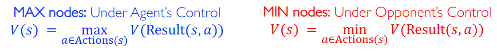
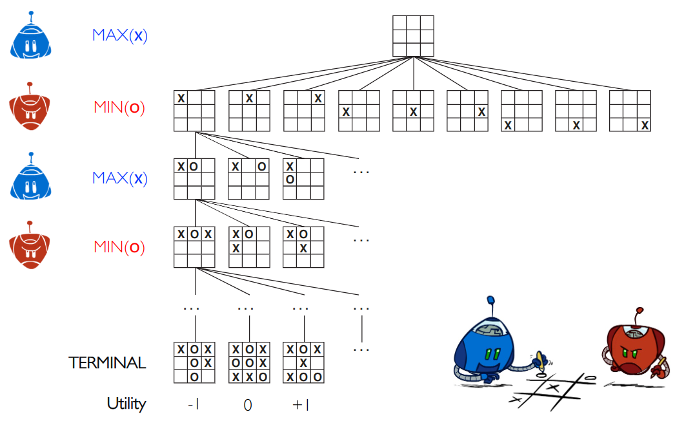
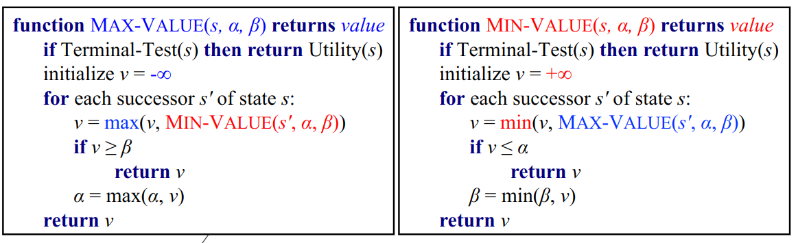
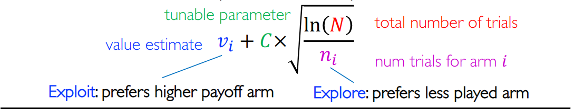
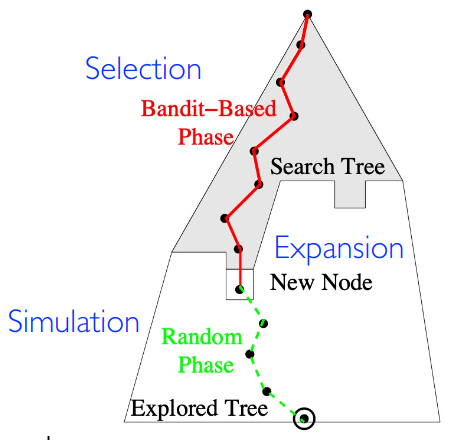

## Adversarial Search
## Minimax Algorithm

#### Minimax Values

- MAX nodes: Under Agent's Control
- MIN nodes: Under Opponent's Control

#### Tic-Tac_Toe Game Tree

#### Minimax Algorithm

- Minimax values: the best achievable utility against a **rational(optimal)** adversary
- Minimax search: 

#### Minimax Properties

$$ V(\pi_{max}, \pi_{min}) \leq V(\pi_{max}, \pi_{opp})  \quad \forall \pi_{opp}$$

$$ V(\pi_{max}, \pi_{min}) \leq V(\pi_{agent}, \pi_{opp})  \quad \forall \pi_{agent}$$

#### Generalized Minimax

**multiple players**

- Generalization of minimax
    - Each player maxmizes its **own component**

#### Minimax Efficiency

- How efficient is minimax
    - Just like (exhaustive) DFS
    - Time: $(b^m)$
        - $b$: The "branch factor"

- Chess: $b \approx 35$, $m \approx 100$
    - Exact solution is completely infeasible

### Alpha-Beta Pruning

$a = $best option so far from any MAX node on this path.

!!!Theorem 
    This Pruning has **no effect** on minmax value computed for the root.

- Move ordering
    - Worst ordering: $O(b^m)$ time
    - Best ordering:  $O(b^{0.5m})$ time
    - Random ordering: $O(b^{0.75m})$ time

- **evaluation function Eval(s)**
    
    - MAX nodes: order successors by decreasing $Eval(s)$
    - MIN nodes: order successors by increasing $Eval(s)$

- **Iterative deepening also helps**

### Real-Time Decisions

**Resource Limits in Realistic Games**

#### Evaluation Function

- Or a more complex nonlinear function (e.g. **Neural Network**)

#### Cutting off Search

#### Quiescence Search

- Terminate search only in quiescent positions

## Games with Uncertain Outcomes

**Chance** node in the Trees

### Minimax -> Expectimax

## Monte Carlo Tree Search

### Go: Failure for Alpha-Beta

- Lack of a good evaluation function
- Alpha-beta search limited to onlt 4 or 5 plies

### Monte Carlo Tree Search (MCTS)

- Evaluation by rollouts
- Selective search

### Upper Confidence Bound

Maximize: **UCBI** formula

### MCTS

- Selection
    - Pick according to UCB
- Expansion
    - Used when we reach the frontier
- Simulation
    - Don't bother with UCB, just play randomly
- Backpropagation

### MCTS: Selection

$$ UCB1(n) = \frac{U(n)}{N(n)} C \times \sqrt{\frac{\log N(Parent(n))}{N(n)}} $$

$U(n):$ the total utility of rollouts that went through node $n$

### MCTS: Backpropagation

- Update $U(n)$ and $N(n)$