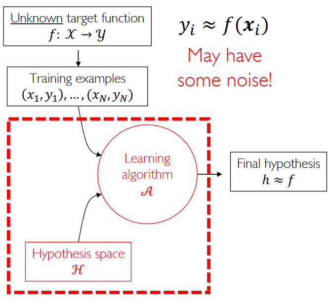
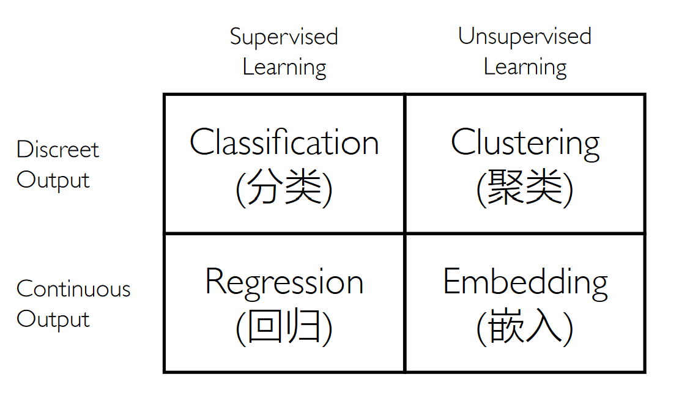
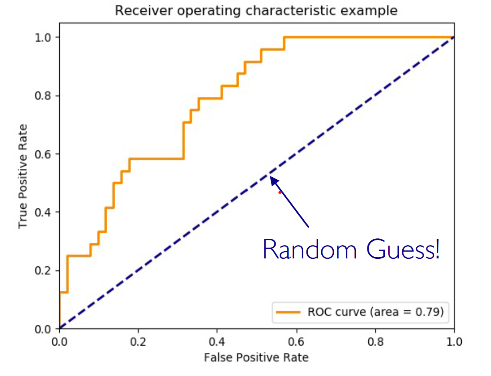
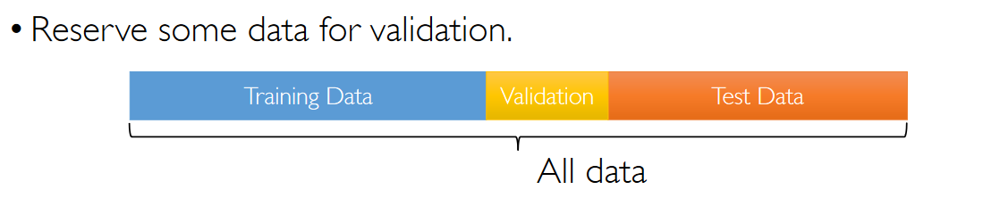

## Machine Learning

- How to build computers that:
    - (automatically) imporve their performance ($P$)
    - at some task $(T)$
    - with experience $(E)$

- Statistical Learning
- Neural Learning

### Framework

#### An Example: Spam Filtering

Task: **binary classification**

Feature extraction: by hand or learn features automatically.

#### Components of Learning

- Input: $x \in R^d$
- Output: $y = \{0, 1\}$
- Target function: $f: \mathcal{X} \to \mathcal{Y}$
- Data: $(x_1,y_1) \cdots (x_N,y_N)$
- Hypothesis: "Possible function to be used for prediction"



#### Hypothesis Space

- Includes only those functions that have desired regularity.
    - Continuity
    - Smoothness
    - Simplicity

**linear !**

#### Loss Function

L2 Loss: Regression

$$ l(y,h(x)) = (y - h(x))^2 $$

Classification Loss:

$$ l(y,h(x)) = 1[y \neq h(x)] $$

The canonical training procedure of machine learning:

$$ \hat{\epsilon}(h) = \min_{\theta} \sum_{ i =1}^m l(h_\theta(x_i), y_i) $$

- The main questions
    - What is the hypothesis function?
    - What is the loss function?
    - How do we solve the training problem?

#### Maching Learning Scenarios


  
- Under fitting
- Approximate fitting
- Over fitting

#### Reinforcement Learning

### Evaluation Metrics

#### Classicication

- Precision $\frac{TP}{TP + FP}$ : How many selected items are relevant
    - "查准率"
    - Search Engine
- Recall $\frac{TP}{TP + FN}$: How many relevant items are selected
    - "查全率"
- Accuaracy $\frac{TP + TN}{TP + TN + FP + FN}$: How many items are hit

F_1-score:

$$ \frac{1}{F} = \frac{1}{2} (\frac{1}{p} + \frac{1}{R}) $$

Confusion Matrix

```py
from sklearn.metrics import confusion_matrix
```

ROC (Receiver Operating Characteristic)

AUC (Area Under the Curve)

#### Regression Error

- Squared Error: MSE
- Absolute Error: MAE




### Model Selection

<center>
**All models are wrong, but some are useful.  -G.E.P Box**
</center>

#### Training and Test Data



**The learning algorithms should never ever have access to test data**

#### Cross Validation

- 5-fold cross validation

#### Model Selection: Whole Procedure

- Combined Algorithm Selection & Hyperparameter optimization problem

*AutoML !*

The complexity is too high ?

*Tuner!!!!*

## K-Nearest Neighbors (KNN)

### Geometric View

- Assumption: Closer points in feature space have similar semantics

### The Effect of K

- Increasing $k$ simplifies the decision boundary
    - Smooth

No parameter to learn in KNN, it is a non-parameter model.

### Feature Normalization

- Z-score normalization

    
## Linear Regression


#### What Model to Choose

- Exploratory Data Analysis to ease model selection

#### Hypothesis Space

#### Loss Function

- L2 Loss


### Optimization

- For general differentiable loss function, use Gradient Descent (GD)
- SGD : minibatch

The complexity of computing analytic Solution is too high.

### Normalization

#### Basis Function

- Polynomial basis functions
- Radial basis functions (RBF)

### Regularization

!!!Question

    **Overfitting**

Solution: Control norm of $w$

L2-Regularization

$$ penalty = \lambda ||w||_2^2 $$

- Smooth Solution

L1-Regularization

$$ penalty = \lambda ||w||_1$$

- Sparse Solution
