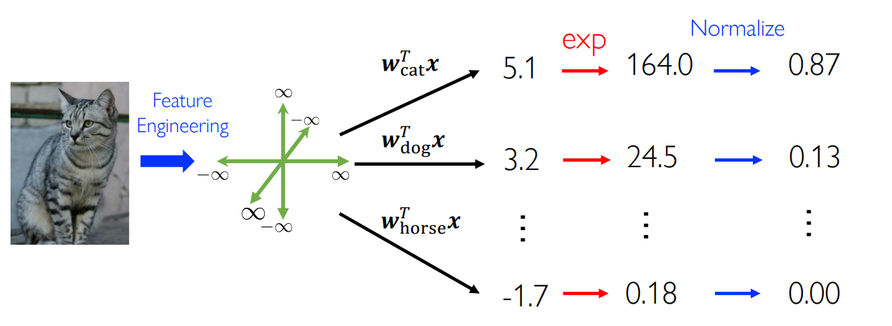
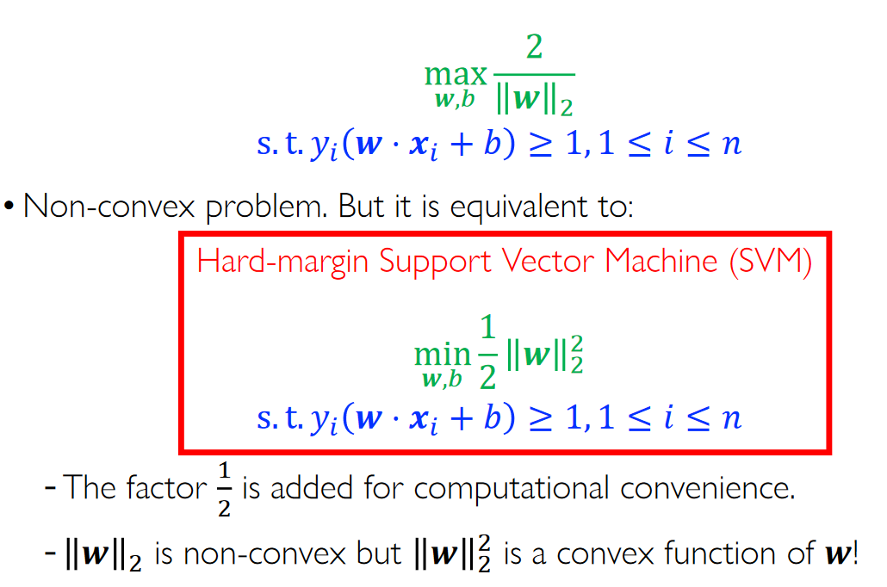
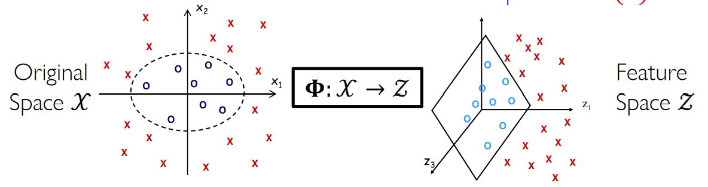
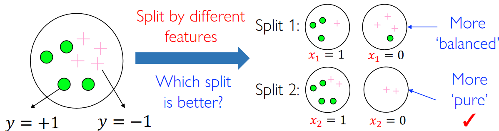

## Linear Classification

### Logistic Regression

#### Regression to Classification

- Naive idea:
    - $\min_{w} \sum_{i = 1}^{n} (h_2(x_i) - y_i)^2 + \lambda \Omega(w)$
- Discretize the continuous output $h_w(x_i)$ to be $\{0,1\}$

#### Logistic Regression

sigmoid function

$$ \sigma(t) = \frac{1}{1 + e^{-t}} $$

- Sigmoid maps $\mathbb{R} \to [0, 1]$
- $t \to \infty$, $\sigma(t) \to 1$

- View $\sigma(h(x)) = p(y = 1 \mid x)$ as the probability to label $x$ as $y = 1$

#### Logistic Regression: Cross-Entropy Loss

Cross-Entropy Loss
- negitive likeihood 
- Information theory

$$
l(h(x_i), y_i) = \begin{cases}
    - log[\sigma(w^T x_i)] & y_i = 1 \\
    - log[\sigma(1 - w^T x_i)] & y_i = 0
\end{cases}
$$

Remark: almost linear when $w^T x_i >> 0$

Square Loss Surface $\Rightarrow$ non-linearity

#### Logistic Regression: Regularization

### Softmax Regression

**Multi-class Logistic Regression**

There are $C$ class, we use $C$ hyper-plane to 'score' their classification

#### Sofgmax Function

$$ P(y = i \mid x) = \frac{\exp(w_i^T x)}{\sum_{r = 1}^C \exp(w_r^T x)}$$

#### Cross-Entropy Loss

$$ l(h(x_i), y_i) = -\log(P(y = i\mid x))$$

!!! Warning
    These two hypotheses have same outputs !

    $$ \textbf{w} \quad \textbf{w} + V \textbf{I}$$

## Support Vector Machine (SVM)

Problem: How to choose the best linear classifier(hyperplane) ?

- Margin: Twice of the distance to the closest points of either class
    - Twice of the largest noise that can be tolerated by the classifier
- Problem: How to find the linear classifier with the largest margin

- Requirements:
    - The margin is the largest
    - Classify all data points correctly
- Constrained optimiaztion problem
    - $y_i (w \cdot x_i + b ) \geq 1, \ 1 \leq i \leq n$

### Hard-Margin SVM

The points closest to the classifier lies on the lines 

$w\cdot x+ b = \pm 1$

margin is $gamma$

$$ \gamma = \frac{2}{\vert w\vert_2} $$

### Soft-SVM

Slack variable: $\xi_i, i \in [n]$

$$
\begin{align}
\min_{w,b,\xi} \frac{1}{2} \vert \textbf{w} \vert_2^2 \\
y_i(w\cdots x_i + b) \geq 1 - \xi_i \\
\xi \geq 0 , \sum_{i = 1}^n \xi_i \leq n' \\
1 \leq i \leq n
\end{align}
$$

#### Hinge Loss

$$ \min_{w,b,\xi} \frac{1}{2} \vert \textbf{w} \vert_2^2 + \frac{C}{n} \sum_{i = 1}^n \xi_i $$

Define Hinge loss $l(f(x), y) = \max \{0,1 - y(f(x))\}$

!!! Theorem

    Soft-SVM is equivalent to a **Regularized Risk Minimization**

    $$ \min_{w,b,\xi} \frac{1}{2} \vert \textbf{w} \vert_2^2 + \frac{C}{n} \sum_{i = 1}^n l(f(x), y) $$

### Kernel method

- Radial basis functions (RBF)
    - $\phi_j(x) = \left\{ \exp\left( - \frac{\vert x - \mu_j\vert^2_2}{2 \sigma^2}\right) : j = 1,\cdots,d\right\}$

- $k(\cdot, \cdot): \mathcal{X} \times \mathcal{X} \to \mathbb{R}$ is called kernel function induced by basis function $\Phi$ if it can be represented as
    - $k(x_1,x_2) = \Phi(x_1)\Phi(x_2)$

### Kernel Functions on Vector Data

- Linear
- Polynomial
- Polynomial with constant terms
- RBF (Gaussian kernel)
- Hyperbolic Tangent

## Decision Tree

- Tabular data
- Categorical

- After the first split, select next best feature until each node contains only one class.

- Hypothesis space of decision tree
    - Decision trees divide the feature space into axis-parallel rectangles
    - Each rectangular region is labeled with a specific label

### Node Splitting

### Node Impurity Measures

Three standard node impurity measures:

- Misclassification error rate
- **Entropy**
- Gini index

### Information Gain (IG)

$$
H(D_1 \cup D_2) - \frac{|D_1|}{|D|} H(D_1) -\frac{|D_2|}{|D|} H(D_2) 
$$