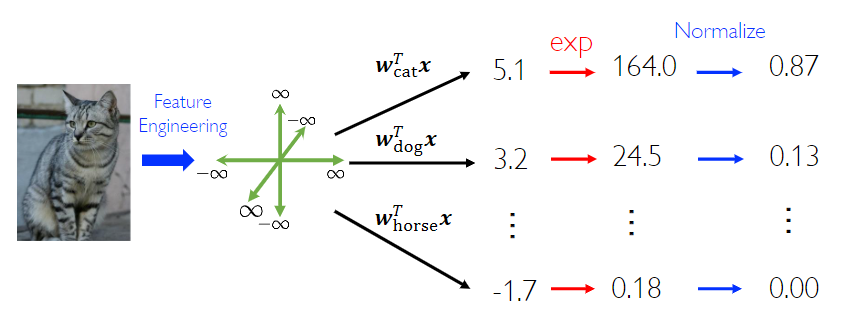

## Linear Regression

### Regularization

!!! Question "Motivation"

    In the example of usage of basis function, we found higher-order polynomial fits data better but may **fit noise **and bring **very large coefficients.**

    Hence we have a penalty of the coefficients, we call these methods "Regularization".

- $L_1$-Regularization

$$
    \hat{w} = \argmin_{w \in \mathbb{R}^d} \sum_{i=1}^{n} (w^T x_i - y_i)^2 + \lambda \Vert w \Vert_1^2
$$

- $L_2$-Regularization

$$
    \hat{w} = \argmin_{w \in \mathbb{R}^d} \sum_{i=1}^{n} (w^T x_i - y_i)^2 + \lambda \Vert w \Vert_2^2
$$

Where $\lambda$ is a positive hyperparameter.

#### The Sparse Solution

!!! note "What is Sparse Solution"

    The Sparse solution is the solution with more **zero** elements

From the above disscussion, it is clear that the regularization method produce more sparse solution.

!!! Question

    Which regularization method produce more sparse solutions?

    In the vision of mathematics, all norms induced by the metric in Eucildean space are "equivalent" ?

The equivalence of norms is in the meaning of "metric", but here we are considering the "sparsity" i.e. the number of zeros in the solution vector.

We need a metric of sparsity.

!!! Definiton "$L_0$ norm"

    $\Vert x \Vert_0 := \#(\text{number of zeros in } x)$

But the $L_0$ norm is too difficult to compute, we need to find the best approximation. At the same time, we hope the approximation is easy to compute and have some good properities.

!!! Theorem

    $L_1$ norm is the best convex approximation of $L_0$ norm.

## Linear Classification

### Design of the Loss function

In the part of linear regression, the loss function is square loss function. In the classification task, the label $y_i \in \{0, 1\}$，

If we still use the square loss function, the continuous output $h_w(x_i)$ will be **discretize** to $\{0,1\}$.

To map the output of $h(x)$ to $[0,1]$, we can use the sigmoid function.

$$
\sigma(t) = \frac{1}{1 + e^{-t}}
$$
And we can view the value $\sigma(h(x)) = p(y = 1\mid x)$ as the probability to label $x$ as $y= 1$

Review the knowledge of Cross-Entropy Loss.

!!! note "Cross-Entropy Loss"

    We have a unknown distribution $P$ and now we want to approximate it by another distribution $Q$. In this process, we need a metric of the performance of the approximator. 
    
    In the information theory, we have a concept of relative entropy.

    $$
        D(p \Vert q) = \mathbb{E}_p \log \frac{p(x)}{q(x)} = - \mathbb{E}_p \log q(x) - H(p)
    $$

    We call the first item cross entropy.

    Hence we have the so-called cross entropy loss function.

    $$
        l(h(x_i), y_i) = \begin{cases}
            - \log[\sigma(h(x_i))] & y_i = 1 \\
            - \log[1 - \sigma(h(x_i))] & y_i = 0
        \end{cases}
    $$

    Another kind of view: the negative log probability of success classification.

For the sake of preventing weights from **diverging** on linearly separable data, we can use the trick of regularization, such as $L_1$, $L_2$.

Another motivation is to get the **unique** solution in the linear separable training data.

Now, we found that the Loss function doesn't have analytic solution, we choose optimization methods to get a better solution.

### From Binary-class to Multi-class

!!! note "Prologue: the categorical distribution"

    Model an experiment with taking $K$ different possibilities coded.

    $$
        \begin{split}
        X = \begin{cases}
        1,&\;\text{with probability}\;p_1,\\
        2,&\;\text{with probability}\;p_2,\\
        \vdots&\\
        K,&\;\text{with probability}\;p_K.
        \end{cases}
        \end{split}
    $$

    The notion

    $$ p(X = x) = p_x $$

    In a sence, the categorical distribution is a generalization of Bernoulli distribution.

To implement multi-class classification, we use multi weight vector to get different score and **normalize** them to get a categorical distribution.

The key is use Softmax function to finish the normalization.

$$
p(y = i \mid x) = \frac{\exp(w_i^T x)}{\sum_{r = 1}^c \exp(w_r^T x)}
$$

## SVM

### Hard SVM

!!! note "Motivation"

    How to choose the best hyperplane of a classification task?

    (for linear separable data)

The key concept of Support vector machine is the "Margin"

!!! note "Margin"

    Twice of the distance to the closest points of either class.

    Equivalently, margin is twice of the largest noise that can be tolerated by the classifier.

The target is 

- largest margin
- Correctly classify all data points

Mathematically, optimize the SVM model is a constrained optimization problem.

$$
\begin{align*}
    \max_{w, b} margin(w, b)\\
    s.t. \ y_i(w \cdot x_i +b ) \geq 1, 1\leq i \leq n
\end{align*}
$$

!!! Question "How to compute margin?"

    Now let us take some math derivation.

    we have a hyperplane $w\cdot x + b = 0$ in Eucildean space, consider the points distributed in the two sides of this hyperplane.

    In one side, for point $(x_i, y_i)$ we can get the inequality $w \cdot x_i + b > 0$，in another size, naturally, $w \cdot x_i + b < 0$

    In space analytic geometry, we have the formula to calculate the distance between a point and a hyperplane

    $$
        distance = \frac{ \vert w\cdot x + b \vert}{\Vert w \Vert }
    $$

    Here we take the label $y_i = \pm 1$.

    Tune the norm of $w$, such that the point closest to the classifier lies on the hyperplanes $w \cdot x + b = \pm 1$

    At this time, we found the margin is 

    $$
        \frac{2}{\Vert w \Vert_2}
    $$

The optimization of the margin can be equivalently transformed to 

$$ \min \frac{1}{2} \Vert w \Vert^2$$

Now, this is a convex optimization problem!

### For separable to non-seperable

Instead of constraining all data points to be correctly classified, we allow some points on the wrong side of the margin.

Obviously, the number of the wrong classified point should be small. We introduce the concept of slack variables to solve this problem

The mathematical formalization following

$$ 
\begin{align*}
    \min_{w,b,\xi} \frac{1}{2} \Vert w \Vert_2^2 + \frac{C}{n} \sum_{i = 1}^n \xi_i \\
    s.t. \quad y_i(w \cdot x_i + b) \geq 1 - \xi_i \\
    \xi_i \geq 0, 1 \leq i \leq n
\end{align*}
$$

The item $\xi_i$ is called "slack variables".

In the part of constrains, we found

$$
\xi_i \geq 1 - y_i(w\cdot x_i + b) \quad \text{and} \quad \xi_i \geq 0
$$

i.e.

$$
\xi_i \geq \max(0, y_i(w\cdot x_i + b))
$$

Define the Hinge Loss function

$$
l(h(x)) = \max(0, 1 - h(x))
$$

The Goal of optimization can be rewrite to 

$$
    \min_{w,b,\xi} \frac{1}{2} \Vert w \Vert_2^2 + \frac{C}{n} \sum_{i = 1}^n \max(0, y_i(w\cdot x_i + b))
$$

!!! Surrogate Loss

    The hinge loss function can be substituted by other functions to get better mathematical properities

    - Exponential loss: $l_{\exp}(x) = \exp(-x)$
    - Logistic loss: $l_{\log}(x) = \log(1 + \exp(-z))$
    
!!! note "Different Views"

    We can introduce the soft SVM without the concept of slack variables.

    We can count the number of wrong classified points and add them into the loss function as a item with a coefficient.

    $$
    \min_{w,b,\xi} \frac{1}{2} \Vert w \Vert_2^2 + \frac{C}{n} \sum_{i = 1}^n l_{0/1}(y_i(w\cdot x_i + b))
    $$

    Where the $l_{0/1}$ is the "0/1 loss function".

    $$
        \begin{cases}
            1& \text{if } z < 0 \\
            0& \text{otherwise}
        \end{cases}
    $$

    But this function is bad in math, we can introduce the concept of "Surrogate Loss" to substitute this function.

### Interlude: Generalization

Look closely at the formula for Soft-SVM

$$
\min_{w,b,\xi} \frac{1}{2} \Vert w \Vert_2^2 + \frac{C}{n} \sum_{i = 1}^n l_{0/1}(y_i(w\cdot x_i + b))
$$

- The first item is the loss caused by the model itself
- The second item is the loss on the training data set

We introducte the general form

$$
\min_f \Omega(f) + \frac{C}{n} \sum_{i = 1}^n l(f(x_i), y_i)
$$

Where the $f$ is the so-called "model".

- The first item is called "Structural risk"
- The second item is called "Empirical risk"
- $C$ is a hyperparameter used to trade-off between these two item.

!!!note  A View of Bayes approximation

    We can think the $\Omega(f)$ as a "Regularization" item. It is used to cut the hypothesis space and introduce the prior knowledge to decrease the risk of overfitting.

### The Dual Problem Theory and The Solution of SVM

Now we use the Lagrange method to directly solve the optimization of Soft-SVM.

The Lagrange function

$$
L(w, b, \alpha, \xi, \mu) = \frac{1}{2} \Vert w \Vert^2 + C \sum_{i = 1}^n \xi_i + \sum_{i = 1}^n \alpha_i (1 - \xi_i -y_i(w \cdot x_i + b)) - \sum_{i = 1}^n \mu \xi_i
$$

Then let the partial derivatives of $w, b, \xi$ equal to $0$, we get the relation

$$
\begin{align*}
    w &= \sum_{i = 1}^n \alpha_i y_i x_i \\
    0 &= \sum_{i = 1}^n \alpha_i y_i \\
    C &= \alpha_i + \mu_i
\end{align*}
$$

Substitude $w, b, \xi$ in the Lagrange function, we can get the dual problem of the original problem.

$$
\begin{align*}
    \argmax_\alpha &\sum_{i = 1}^n \alpha_i - \frac{1}{2} \sum_{i = 1}^n \sum_{j = 1}^n \alpha_i \alpha_j y_i y_j x_i \cdot x_j \\
    s.t. &\sum_{i = 1}^n \alpha_i y_i =0 , 0 \leq \alpha \leq C
\end{align*}
$$

### From linear to non-linear

Recall: We use the basis function to bring nonlinearity in the linear Regresssion models.

The idea is do some transform on the original feature space, then calculate the Regression problem in the new (maybe better) feature space.

Here we will do the same, perform some transform on the feature space and then calculate the optimization problem.

From the result previous section, If we have the transformation $\phi$，the result will be

$$
\argmax_\alpha \sum_{i = 1}^n \alpha_i - \frac{1}{2} \sum_{i = 1}^n \sum_{j = 1}^n \alpha_i \alpha_j y_i y_j \phi(x_i) \cdot \phi(x_j)
$$

But the construction of $\phi$ is difficult, we try to directly construct $K(x, y)$, such that there exisit $\phi$ and $K(x,y) = \phi(x) \cdot \phi(y)$

!!!note "Reproducing kernel Hilbert space"

    First, let's introduce some definitions.

    !!! note "Evaluation functional"

        let $\mathcal{H}$ be a Hilbert space of functionals $f: \mathcal{X} \to R$, fix $x \in \mathcal{X}$, $\delta_x : H \to \mathbb{R}$, $\delta_x := f \to f(x)$ is called the (Dirac) evaluation function.

    !!! note "Reproducing kernel Hilbert space, RKHS"

        If $\delta_x$ is continuous, then $H$ is a Reproducing kernel Hilbert space, RKHS
    
    !!! note "Reproducing Kernel"

        $\mathcal{H}$ is a Hilbert space of functaionals $f: \mathcal{X} \to \mathbb{R}$. If function $k : \mathcal{X} \times \mathcal{X} \to \mathbb{R}$, satisfying

        - $\forall x \in \mathcal{X}$, $k(\cdot, x) \in \mathcal{H}$
        - $\forall x \in \mathcal{X}$, $\forall f \in \mathcal{H}$, $<k(\cdot, x), f>_\mathcal{H} = f(x)$

        Then we call $k$ a reproducing kernel.

    It is easy to prove: if there exist a reproducing kernel in a Hilbert space $\mathcal{H}$, then it is unique.

    The following theorem shows the relation between RKHS and Reproducing kernel.

    !!! note "Theorem"

        If there exist a Reproducing kernel, then we have 

        $$
        \begin{align*}
            |\delta_x f| &= |f(x)| \\
            &= |<f,k(\cdot, x)>_\mathcal{H}| \\
            &= \Vert f \Vert \Vert k(\cdot, x)\Vert \\
            &= \Vert f \Vert \cdot k(x, x)^{1/2}
        \end{align*}
        $$

        A linear functional is continuous if and only if it is bounded.

        If $\mathcal{H}$ is a Hilbert space, by the Riesz repersentation theorem.

    !!! note "Kernel"
        
        $k: \mathcal{X} \times \mathcal{X} \to  \mathbb{R} $ if there exist $\phi: \mathcal{X} \to \mathcal{H}$ s.t.
        
        $$ k(x, y)= <\phi(x), \phi(y)>_{\mathcal{H}} \forall x, y\in \mathcal{X}$$

        Then $k(x, y)$ is a kernel.
    
    Remark: $k(x_i, x_j)$

## Decision Tree

## Random Forest

## Other Machine Learning Model

### PCA 

### NMF

### 

## MLP

## AutoEncoders

## CNN

## RNN

## Attention

## Transformers
