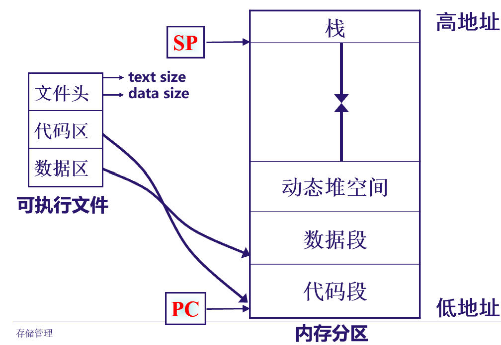
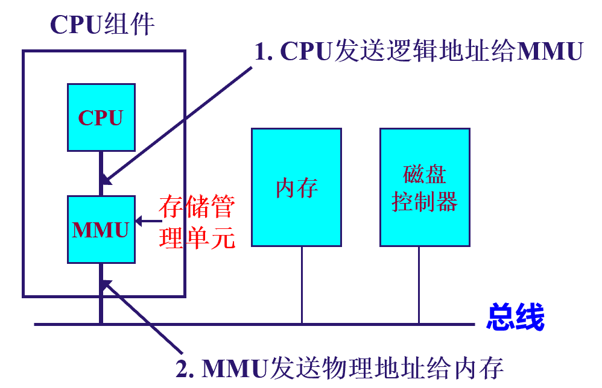
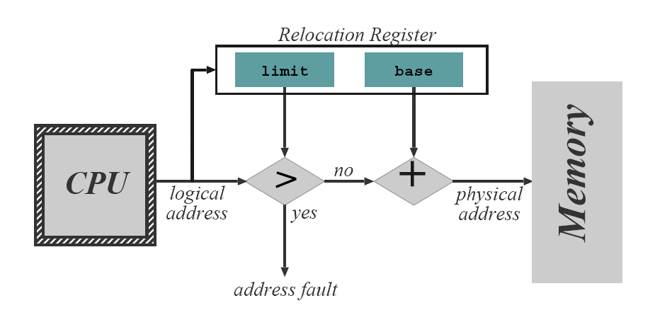
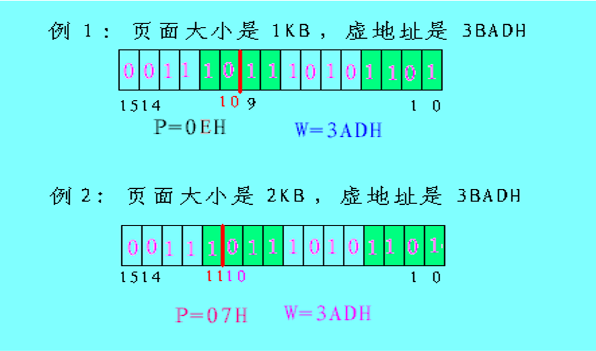
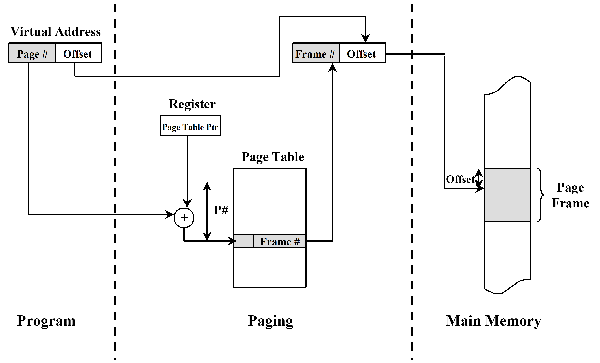
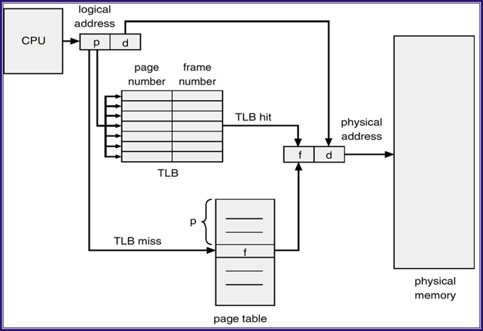
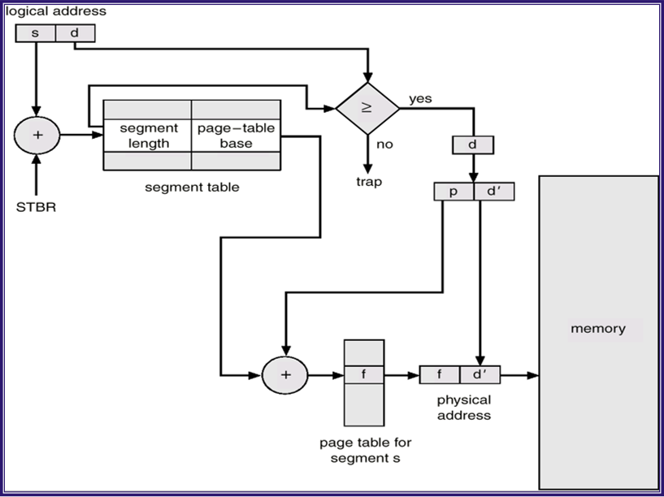

## 单道程序存储管理

内存分为两个区域：系统区和用户区，每次把一个应用程序塞到用户区内存里，以来共享内存。当它运行结束后，操作系统装入一个新的程序把它覆盖。

- 优点：简单、开销小，易于管理，适合于单用户单任务的情形
- 缺点
    - 每次只能运行一个程序
    - 内存资源的使用效率不高
    - 应用程序的 bug 会破坏 OS
    - 地址空间有限

### 如何实现多道存储管理

也就是说在内存中同时有多个进程运行。

- 需要考虑的问题
    - 

## 分区存储管理

内存分为两大区域：系统区和用户区，用户区又划分为若干分区，一个进程占用一个分区。

- 适合多道程序系统和分时系统，支持多个程序并发执行

### 固定分区存储管理

各个用户分区的个数、位置和大小确定，就固定不变。

- 分区的大小是否相等？
    - 程序大小不同，则进程占用空间不同
    - 多个小分区，适量中等分区，少量大分区
- 进程个数多于分区个数？
    - 增加一个输入队列

#### 如何实现？

- 数据结构：设置内存分配表
- 内存分配：先放入输入队列，然后采用最先匹配法，最佳匹配法等算法
- 内存回收：简单

### 可变分区的实现

**如何实现可变分区的存储管理技术？**

#### 分区链表

系统维护一个有序的分区链表，跟踪记录每个内存分区的情况，包括该分区的状态、起始地址、长度等信息。

#### 分区分配算法

当一个新进程到来时，需要为它寻找分配某个空闲分区，其大小必须大于或等于该进程的要求。

- 最先匹配法
    - 从分区链表的头结点开始向后找，知道找到一个结点长度大于新进程对内存大小的要求的结点
- 下次匹配法
    - 和最先匹配法类似，每找到一个合适的结点时，就把当前的位置记录下来，下次从这个位置开始继续往下找
- 最佳匹配法
    - 找到与新进程对内存大小要求最接近的空闲分区之中。
    - 缺点：分割后剩余的空闲分区将会很小，甚至无法使用
- 最坏匹配法
    - 将最大的空闲区切一部分分给请求者

#### 分区回收算法

当一个进程运行结束，释放它所占用的分区后，需要将相邻的几个空闲分区合并为一个大的空闲分区

#### 存储管理案例

#### 内存中的程序执行

进程的地址空间，**内存布局**是什么样的？

- 全局变量：固定地址，其它源文件可见
- 静态全局变量：固定地址，但只在本文件中可见
- 函数参数：位于栈帧之中，动态创建，动态释放
- 静态局部变量：固定地址，只在本函数中可见
- 普通局部变量：位于栈帧中，只在本函数可见
- 动态申请的内存：位于堆中

这些固定地址的东西放在数据段中，数据段位于代码段和动态堆空间之间。

#### 地址映射

##### 物理地址

- 把内存分成很多个大小相等的存储单元，每个单元给一个编号，这个编号称为物理地址，可以直接寻址。物理地址的集合称为物理地址空间。

##### 逻辑地址

- 也叫相对地址，虚地址
- 用户程序经汇编或编译后形成目标代码，目标代码通常采用相对地址的形式，其首地址为0，其余指令中的地址都是相对首地址来编址；
- 不能用逻辑地址在内存中读取信息

##### 地址映射

- 需要将用户程序中的逻辑地址转换为运行时有及其直接寻址的物理地址，此过程称为地址映射。
- **静态地址映射：**当用户程序被装入内存时，直接对指令代码进行修改，一次性实现到物理地址的转换。
- **动态地址映射：**在程序运行过程中，当需要访问内存单元时再来进行地址转换
    - 由**硬件地址映射机制**完成，
    - 在程序运行时，硬件自动完成地址映射

#### 存储保护

为了防止一个用户程序去访问其它用户程序的内存分区，保护操作系统免受用户程序的破坏。

- 最简单的做法：在基地址寄存器的基础上再增加一个限长寄存器，这两者一起，就定义了进程所在的分区
  

## 页式存储管理

### 基本原理

- 把物理内存划分成许多个固定大小的内存块，称为物理页面，或**页框**（page frame）
- 把逻辑地址空间划分为大小相同的块，称为**逻辑页面**（page）
- 页面大小为 $2^n$
- 若要运行一个大小为 $n$ 个页面的程序，需要有 $n$ 个空闲的物理页面，这些页面不必是连续的。

### 需要解决的问题

- 用于存储管理的数据结构？
- 当一个进程到来时，如何分配内存？
- 当一个进程运行结束，如何回收内存？
- 当一个进程被加载到内存以后，如何正确运行（地址映射）？

### 数据结构

**页表：**为每个进程建立一个页表，页表给出逻辑页号和具体内存块号之间的对应关系。

**物理页面表：**在系统中设立一张物理页面表，用于描述内存空间中，各个物理页面的分配使用状况，一个具体的实现方式为“位示图”

### 内存的分配与回收

**内存的分配：**

- 计算一个进程需要的页面数 $N$，并查看位示图，看看空闲页面够不够
- 若有足够的空闲页面，申请一个页表，其长度为 $N$，把页表的起始地址填入 PCB
- 分配 $N$ 个空闲物理页面，将其编号填入页表
- 修改位示图

**内存的回收：**

- 就是上面过程的简单逆过程

### 地址映射

- 对于给定的逻辑地址，找到逻辑页面号和页内偏移量
- 查页表
- 计算物理地址

#### 逻辑地址的划分

地址的高位部分为页号，低位部分为页内偏移量（所以说页表的大小为 $2 ^k$）

- 计算的方法
    - 逻辑页号 = 虚地址 / 页大小
    - 业内偏移 = 虚地址 % 页大小
    - 这和上面那个过程是一样的

### 页表的具体实现

- 页表保存在内存当中
    - 放在 kernel 中
- 设置一个页表基址寄存器（Page-Table base register, PTBR），指向页表起始地址
- 设置一个页表长度寄存器（Page-Table length register，PTLR），指示页表大小

每一次访问内存时，都要两次访问内存（页表、数据/指令）。

### 加快页表的查询速度

- 一种特殊的快速查找硬件：TLB（Translation Lookaside Buffer）或称 associative memory。

### 优缺点

- 优点
    - 没有外碎片，内碎片大小不超过页面的大小
    - 一个程序不必连续存放
    - 便于管理
- 缺点
    - 程序必须一次性装入内存
    - 每个进程都得整一个页表

## 段式存储管理

### 动机

页式存储管理只有一个逻辑地址空间，即一维的线性连续空间。

- 存储保护
- 存储共享 

### 基本原理

- 对程序的每个逻辑单元（代码、数据、栈等）设立一个完全独立的地址空间，称为“段”。每个段的内部是一维的线性连续地址，大小可不同。
- 对于物理内存来说，采用可变分区的管理办法
- 当一个程序需要装入内存时，以段为单位进行分配，把每个段装入一个内存分区中，这些分区不必是连续的。

### 具体实现

用户空间地址为二维地址 （段号，段内偏移）。实现方式：

- 地址高端为段号，低端为偏移
- 指令中显式给出段号和段内偏移

**段表：**系统为每个进程建立一个段表，它给出了进程当中的每一个段和它所对应的内存分区之间的映射关系。段表保存在内存中，同理整两个 STBR 和 STLR，指示段表的起始地址和程序中段的个数

### 优缺点

- 优点
    - 程序通过分段来划分多个模块，每个模块可以分别编写和编译，可以针对不同类型的段采取不同的保护，可以按段为单位来进行共享
    - 一个程序不必连续存放，没有内碎片。
- 缺点
    - 程序必须全部装入内存
    - 有外碎片

### 段页式存储管理

**先把程序划分为页，然后在段内分页**

## 虚拟存储技术

**内存可能出现不够用的情况**。

理论依据：程序的局部性原理，实际上 TLB， Cache都是局部性原理应用的成功案例

### 基本思路

采用**虚拟页式**存储管理技术，即在页式存储管理的基础上，增加请求调页和页面置换功能。

基本思路：当一个用户程序要调入内存运行时，不是将该程序的所有页面都装入内存，而是只装入部分的页面（1个或多个），就可启动程序运行。在运行的过程中，如果发现要执行的指令或要访问数据不在内存，则发出缺页中断请求，系统在处理这个中断时，将外存中相应的页面调入内存，使得该程序能继续运行。

保存到磁盘上的那部分存储称为 **后备存储**（backing store），内存物理页面称为 Page frame，磁盘上的页面称为 backing frame（后备页面）

### 基本问题

- 如何发现执行的代码或访问的数据不在内存（数据结构）
- 代码或数据什么时候调入内存（调入策略）
- 当一些页要调入内存，而内存没有空闲空间时，将淘汰那些页（淘汰策略）

### 页表表项

每个页表项包含以下信息：逻辑页号、物理页号、驻留位、保护位、修改位、访问位。

## Windows 存储管理

## Linux 存储管理