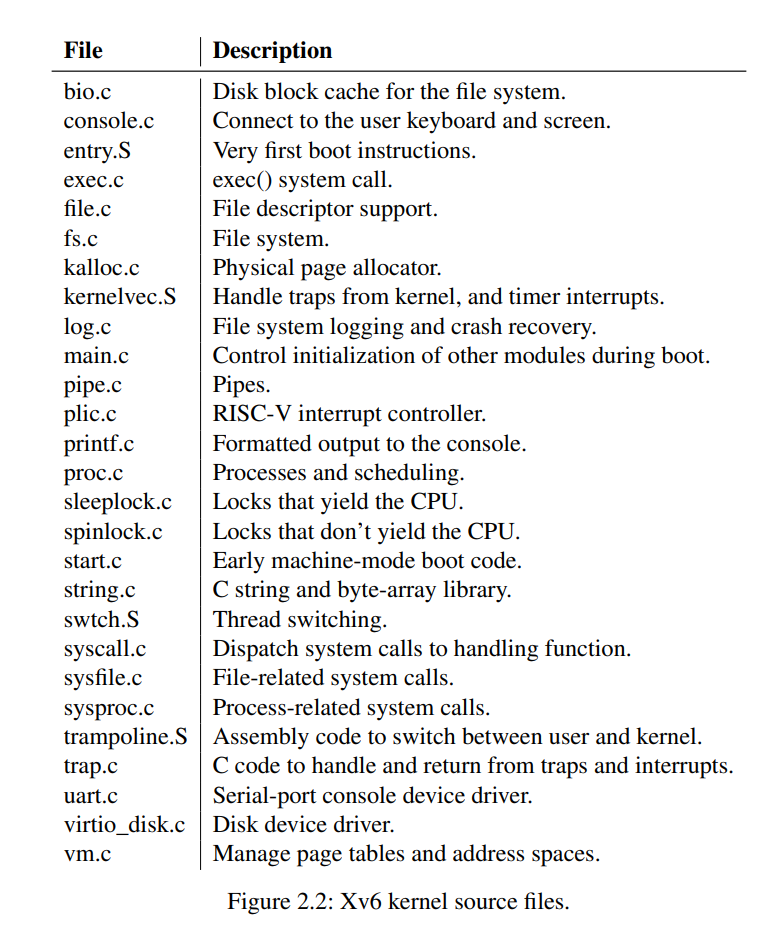

操作系统一个重要的要求是能同时实现多个活动并实现资源的 'time-share'。进程间也要实现 isolation，一个有 bug 的进程不应该影响其它进程。但是完全的隔离又过于严重，因为进程间需要交互和通信，pipelines 就是一个例子。

一个操作系统需要满足三个需求

- mulitplexing
- isolation
- interaction

This text focuses on mainstream designs centered around a monolithic kernel, which is used by many Unix operating systems.

Xv6 运行在一个多核的 RISC-V 微处理器上，它的许多底层功能，例如进程操作都是 specific to RISC-V 的。

The CPU in a complete computer is surrounded by support hardware, much of it in the form of I/O interfaces. Xv6 is written for the support hardware simulated by qemu’s “-machine virt” option. This includes RAM, a ROM containing boot code, a serial connection to the user’s key-board/screen, and a disk for storage.

## Abstrcating physical resources

!!! Question
    
    **为什么不把操作系统做成一个 library？**

    如果有多个进程，这样做的缺点就会显现出来。

为了实现 strong isolation，禁止应用访问敏感的硬件资源是必要的，取而代之的是，我们可以将硬件设备抽象成服务。例如在 Unix 中，我们不是直接读写磁盘上的文件，而是通过 `open`，`read` 之类的 system calls 来完成操作。

Similarly, Unix transparently switches hardware CPUs among processes, saving and restoring register state as necessary, so that applications don’t have to be aware of time sharing.

这样的 transparency 使得操作系统能够让应用程序共享 CPU，即使其中的一些有无限的循环。

!!! Example

    Unix 用 `exec` 命令来创建内存映像，而不是直接同物理内存交互。

## User mode, supervisor mode, and system calls

操作系统应该能够清理掉 failed application，并且继续运行其他的引用程序，为了实现这种 strong isolation，操作系统必须使得应用程序不能修改操作系统的数据结构和指令，应用程序也不能访问其它进程的内存。

CPU 提供了 strong isolation 的硬件支持，例如，在RISC-V CPU 有三种模式，

- machine mode 
    - have full privilege
    - mostly intended for configuring a computer
    - Xv6 executes a few lines in machine mode and the change to supervisor mode
- supervisor mode
    - CPU is allowed to execute privileged instructions
- user mode

当一个 user mode 的应用试图执行一个 privileged instruction，CPU 不会执行这个命令，反而会切换到 superivisor mode 使得 supervisor mode 的代码能够 terminate 这个应用程序（因为它做了不该做的事情）。

**The software running in kernel space is called the kernel**

想要调用 kernel function 的程序应该放进 kernel 中，一个应用程序不能直接调用 kernel function。 CPU 提供了一个特殊的指令，它被用来从 user mode 切换到 supervisor mode （在 RISK-V 中 `ecall` 提供了这个功能。）一旦 CPU 切到了 supervisor mode，kernel 可以判断 system call 的参数是否合法，并决定是否允许应用程序进行这个操作。

!!! Remark

    It is important that the kernel control the entry point for transitions to supervisor mode; if the application could decide the kernel entry point, a malicious application could, for example, enter the kernel at a point where the validation of arguments is skipped.

## Kernel organization

一个关键的问题是操作系统的那一部分需要运行在 supervisor mode 中。

!!! Remark "monolithic kernel"
    
    **整个操作系统全在 supervisor mode 中。**

    这种组织方式的一个缺点是操作系统的不同部分的接口经常是复杂的，从而操作系统的开发很容易出现错误。在一个 monolithic kernel 中，错误是致命的，因为一个 supervisor mode 的错误经常导致 kernel to fail，这样计算机和上面运行的所有程序都一起寄了。

为了减少内核中错误带来的风险，操作系统的设计者们尽量减少了操作系统运行在 supervisor mode 的代码的数量，将操作系统的主体放在 user mode，这种内核的组织方式称之为 microkernel

在microkernel 中，内核的接口由许多的底层函数构成，例如

- starting applications
- sending messages
- accessing devices hardware

这种组织方式允许内核相对简单，因为操作系统的大部分都还在 user-level。

!!!Remark "Real World"

    In the real world, both monolithic kernels and microkernels are popular. Many Unix kernels are monolithic. For example, Linux has a monolithic kernel, although some OS functions run as user-level servers (e.g., the windowing system). Linux delivers high performance to OS-intensive applications, partially because the subsystems of the kernel can be tightly integrated.

    There is much debate among developers of operating systems which organization is better, and there is no conclusive evidence one way or the other. Furthermore, it depends much on what “better” means: faster performance, smaller code size, reliability of the kernel, reliability of the complete operating system (inclusing user-level services), etc.

## Process overview

The unit of isolation in xv6 and in other Unix operating systems is a process.

Xv6 uses page tables (which are implemented by hardware) to give each process its own address space. The RISC-V page table translates (or "maps") a virtual address (the address that an RISC-V instruction manipulated) to a physical address.

