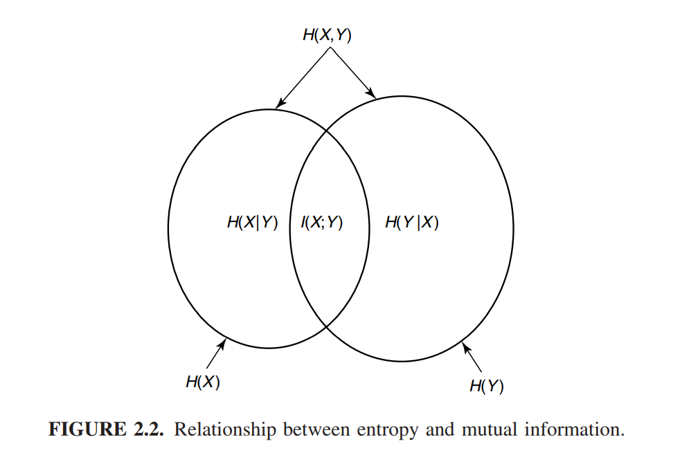

# 熵，相对熵和互信息

我们很难定义一个描述信息的量，但是对于一个概率分布，我们可以定义熵这个量来描述“信息的度量"

## 熵

!!!definition
    离散型随机变量$X$的熵$H(X)$定义为

    $$H(X) = - \sum_{x \in \mathcal{R}} p(x) \log P(x)$$

    如果使用底为$b$的对数函数，则记为$H_b(X)$

熵实际上是概率分布函数的泛函，它只取决于概率分布，与随机变量的取值无关。

随机变量$X$的熵也可以解释为$\log \frac{1}{p(x)}$的期望值，其中$X$服从概率分布$p(x)$。

熵有一些简单的性质

!!!property
    - $H(X) \geq 0$
    - $H_b(X) = \log_b a H_a(X)$

!!!example
    设$H(X)$服从成功概率为$p$的两点分布，计算它的熵
    
    $$H(X) = -p\log p - (1 - p)\log(1-p)$$

    我们将这个数值定义为$H(p)$，这个例子实际上是很有意思的。我们可以发现$H(p)$是关于$p$的凹函数，当$p = \frac 12$时，熵为$1$取得最大值，当$p = 0，1$时，$H(p) = 0$也就是随机变量不再有不确定度。

!!!example 多元分布问题

## 联合熵和条件熵

!!!definition
    对于服从联合分布$p(x,y)$的一对离散型随机变量，其联合熵（joint entropy）$H(x,y)$定义为
    
    $$H(X,Y) = -\sum_{x\in\mathcal{X}} \sum_{x\in\mathcal{Y}} p(x,y)\log p(x,y)$$
    
    我们还定义条件熵为

    $H(Y|X) = -\sum_{x \in \mathcal{X}} p(x) H(Y|X = x) = - E_{p(x,y)} \log p(Y|X)$

类似于概率论中的条件概率，条件熵也有chain rule
!!!theorem
    $$H(X,Y) = H(X) + H(Y|X)$$
    ???proof
        $$\log p(x,y) = \log p(x) + \log p(y|x)$$

        方程两边同时取数学期望

这个定理说明的东西也很有意思，大概就是$X,Y$的信息量等于$X$的信息量加上已知$X$的知识后再得到$Y$的知识时获取的信息量。

## 相对熵和互信息

熵是随机变量不确定度的度量，本节讨论的相对熵是两个分布之间距离的度量。相对熵$D(p||q)$度量的是当真实分布为$p$而假定分布为$q$时的无效性。例如已知随机变量的真实分布为$p$，我们可以构造平均描述长度为$H(p)$的码，但是如果使用针对分布为$q$的码，那么平均意义上需要$H(p) + D(p||q)$比特来描述这个随机变量。

!!!definition
    两个概率分布之间的相对熵，或者说Kullback Leibler距离定义为

    $$
        D(p||q) = \sum_{x\in\mathcal{X}} p(x) \log{p(x)}{q(x)} \\
                = E_p \log\frac{p(x)}{q(x)}
    $$

!!!definition
    考虑两个随机变量$X,Y$，他们的联合概率密度函数为$p(x,y)$，边际密度函数分别为$p(x),q(x)$。互信息$I(x,y)$定义为联合分布$p(x,y)$和乘积分布$p(x)p(y)$之间的相对熵

    $$I(X;Y) = E_{p(x,y)} \log \frac{p(X,Y)}{p(X)p(Y)}$$

## 熵与互信息之间的关系

!!!theorem
    $I(X;Y) = H(X) - H(X|Y)$

    也就是说互信息$I(X;Y)$是在给定$Y$的知识条件下$X$的不确定的度的缩减量

熵与互信息之间的关系可以用一个Venn图来精确表示

## 熵、相对熵和互信息之间的链式法则

类似概率论之中计算概率的链式法则一样，熵也有计算的链式法则
!!!theorem
    设随机变量$X_1,X_2,\cdots,X_n$服从$p(x_1,x_2,\cdots,x_n)$，则有
    
    $$H(x_1,x_2,\cdots,x_n) = \sum_{i = 1}^{n} H(x_i|x_{i_1},\cdots,x_1)$$

我们引入条件互信息的概念，用于描述在给定$Z$的状况下，$Y$的知识对$X$的知识造成的不确定度的缩减

!!!definition
    随机变量$X,Y$在给定随机变量$Z$下的条件互信息定义为

    $$
        I(X;Y | Z) = H(X|Z) - H(X|Y,Z) = E_{p(x,y,z)} \log \frac{p(X,Y,Z)}{p(X|Z)p(Y|Z)}
    $$

!!!theorem 
    （互信息的链式法则）
    
    $$I(X_1,X_2,\cdots,X_n;Y) = \sum_{i = 1}{n} I(X_i; Y | X_{i-1},X_{i -2},\cdots,X_1)$$

一个值得思考的问题是这个定理描述了什么：左边的互信息表示给定$Y$的知识状况下，$X_1,X_2,\cdots,X_n$的不确定度的缩减量。右边表示逐个知道给定$Y$的状况下，知道一个$X_i$的信息对不确定度造成的缩减量。

