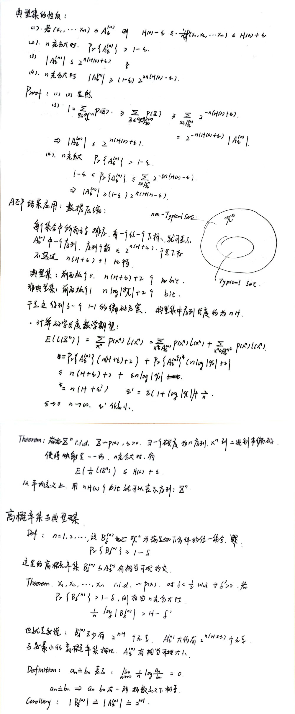

# 引言

在概率论中，我们学习过大数定律。信息论中与之类似的东西就是渐进均分性(AEP)，对于一个i.i.d的随机变量序列，我们有$\frac{1}{n} \log \frac{1}{p(X_1,X_2\cdots,X_n)}$近似于熵$H$。

当$n$很大的时候，对应的概率$p(X_1,X_2\cdots,X_n)$，近似等于$2^{-nH}$，这促使我们定义典型集（typical set）的概念。

# 渐进均分性的定义

!!!Theorem "Asymptotic equipartition property"
    若$X_1,X_2\cdots,X_n$为i.i.d序列且服从$p(x)$，则有

    $$-\frac{1}{n} \log \frac{1}{p(X_1,X_2\cdots,X_n)} \to H(X)$$

证明对$\log P(X_i)$应用大数定律即可。

!!!Definition "Typical Set"
    关于$p(x)$的典型集$A_{\epsilon}{(n)}$被定义为满足下面性质的序列$(x_1,x_2,\cdots,x_n)$的集合

    $$2^{-n(H + \epsilon)} \leq p(x_1,x_2,\cdots,x_n) \leq 2^{-n(H -\epsilon)}$$

根据渐进均分性，我们可以证明下列关于典型集的性质

